# Benutzerhandbuch

Dieses Repository enthaelt die persoenliche GitHub Page von **Felix Staacke**. Die Website ist unter dem Namen `datenflix007.github.io` organisiert und gehoert zu Felix Staacke. Sie dient als persoenliche Webpraesenz, Projektarchiv, Tool-Sammlung, Guide-Bibliothek und Dokumentation verschiedener Studien-, Lehr- und Bastelprojekte.

Die Seite ist bewusst nicht nur eine Visitenkarte. Sie sammelt online nutzbare Module, interaktive Lernumgebungen, technische Guides, Referenzen, Publikationen, kleine Webtools und externe Projektverweise an einem Ort.

## Schnellstart fuer Nutzerinnen und Nutzer

Wenn die Seite online ueber GitHub Pages geoeffnet wird, ist die Startseite der Einstieg:

```text
https://datenflix007.github.io
```

Lokal kann die Seite direkt aus dem Repository geoeffnet werden:

```bash
python -m http.server 8000
```

Danach im Browser:

```text
http://localhost:8000
```

Ein lokaler Server ist besser als ein direkter Doppelklick auf `index.html`, weil einige Module Daten per `fetch` laden oder relative Pfade nutzen.

## Screenshot-Verzeichnis

Die README nutzt echte, lokal erzeugte Screenshots der aktuellen Seiten. Sie liegen unter:

```text
media/readme/
media/readme/modules/
```

Die Screenshots wurden aus den realen HTML-Seiten aufgenommen, nicht nur aus den hinterlegten Kartenbildern.

| Bereich           | Screenshot                                      |
| ----------------- | ----------------------------------------------- |
| Startseite        | 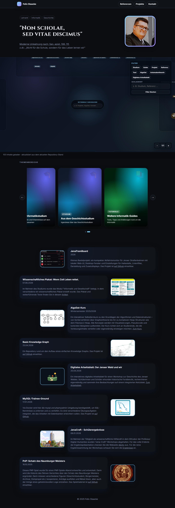      |
| Projektuebersicht | 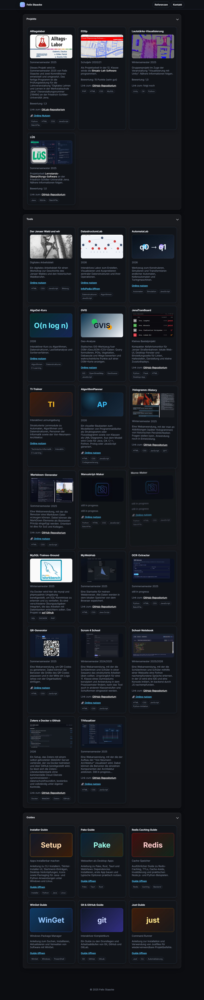 |
| Guide-Uebersicht  | 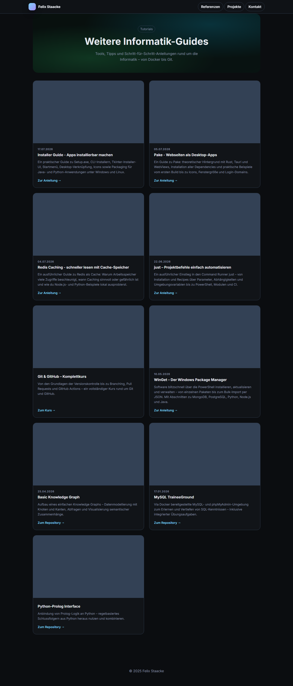    |
| Referenzen        | 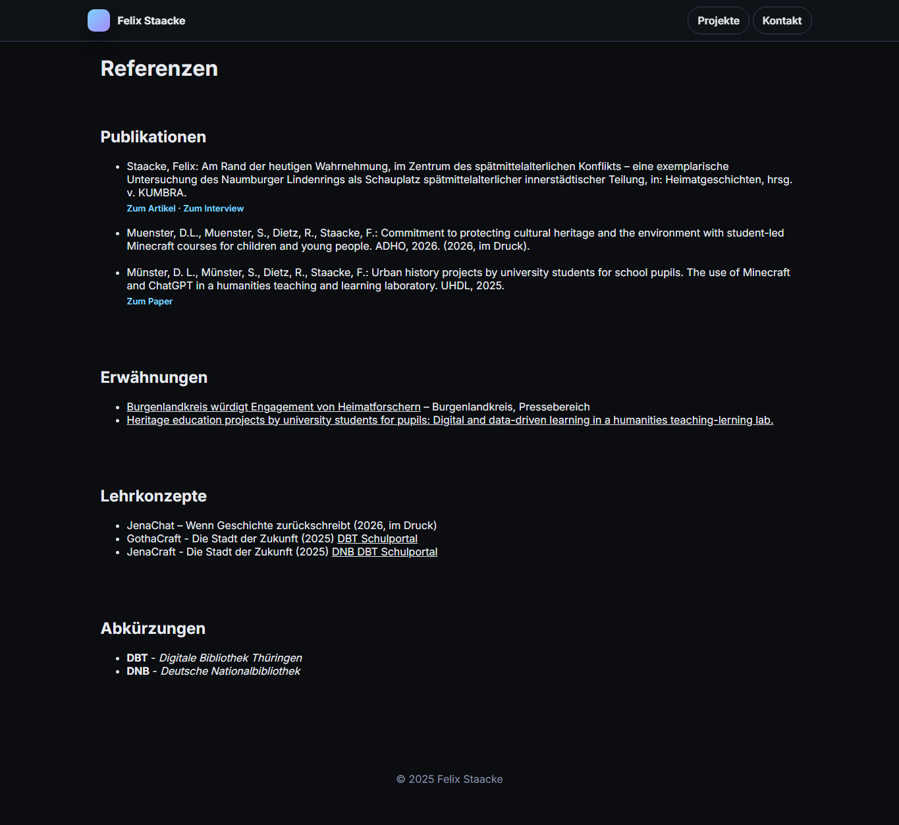      |
|                   |                                                 |

Die Website besteht aus vier zentralen Einstiegspunkten:

- **Startseite**: `index.html`
- **Projekte, Tools und Guides**: `src/projekte.html`
- **Weitere Informatik-Guides**: `src/weitere-guides.html`
- **Referenzen**: `src/Referenzen.html`
- **Kontakt**: `src/kontakt.html`

Auf der Startseite gibt es ausserdem einen interaktiven Wissensgraphen. Dieser durchsucht und verknuepft Inhalte aus dem Repository. Ueber Filter wie `Tool`, `Guide`, `Projekt`, `Referenz`, `AlgoDat` oder `Automatentheorie` koennen Inhalte eingegrenzt werden.


## Projektuebersicht benutzen

Datei:

```text
src/projekte.html
```

Die Projektuebersicht ist die wichtigste Nutzungsseite. Sie ist in drei aufklappbare Bereiche gegliedert:

1. **Projekte**
2. **Tools**
3. **Guides**

In den Projektkarten stehen jeweils Kurzbeschreibung, Vorschau, Tags und Links. Wenn ein Modul direkt auf dieser Website liegt, gibt es meist einen Link **Online nutzen**. Wenn ein Projekt extern gepflegt wird, zeigt die Karte auf das jeweilige GitHub- oder GitLab-Repository.


## Online nutzbare Module

Die folgenden Module koennen direkt im Browser genutzt werden. Sie liegen im Repository unter `src/modules/` und werden ueber GitHub Pages als statische Webanwendungen ausgeliefert.

---

## AlltagsLabor

Pfad:

```text
src/modules/AlltagsLabor/index.html
```

Screenshot:

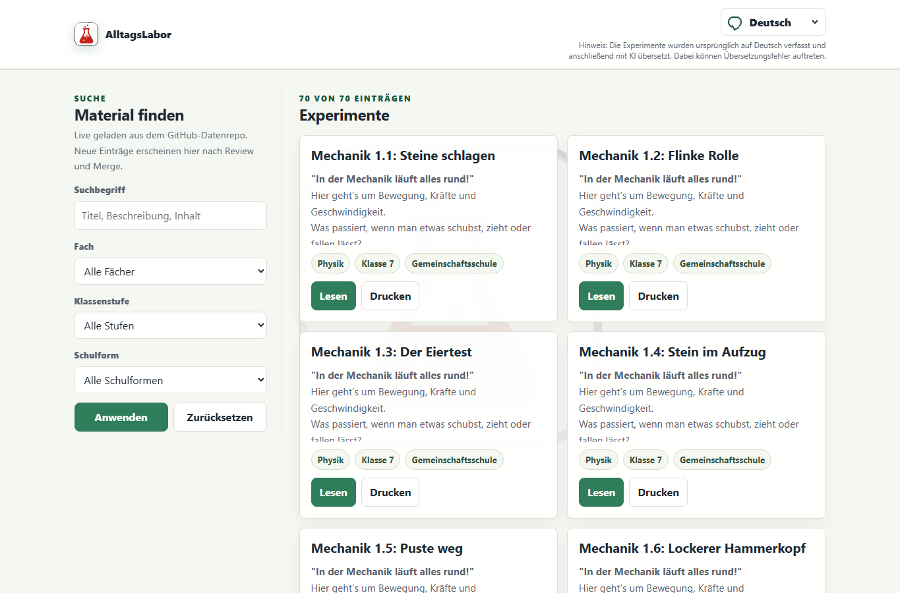

### Zweck

AlltagsLabor ist eine offene Sammlung alltagsnaher Experimente und Lernmaterialien. Das Modul richtet sich an Schule, Projektarbeit und eigenes Forschen. Experimente werden als Karten angezeigt und koennen gesucht, gefiltert, geoeffnet und gedruckt werden.

### Bedienung

1. Modul oeffnen.
2. Ueber die Suchleiste nach Experimenten suchen.
3. Filter nutzen, um Fach, Klassenstufe oder Thema einzugrenzen.
4. Eine Experimentkarte oeffnen.
5. In der Detailansicht Schritte, Aufgaben, Hinweise und Medien lesen.
6. Bei Bedarf Druck- oder PDF-Funktion nutzen.

### Typische Nutzung

- Lehrkraft sucht ein Experiment fuer eine Unterrichtsstunde.
- Schuelerinnen und Schueler oeffnen ein Experiment im Browser.
- Projektgruppe sammelt Ideen fuer alltagsnahe Experimente.
- Material wird als PDF gesichert oder ausgedruckt.

### Hinweise

Die Besucheransicht laedt Daten aus einem externen Datenrepository. Wenn keine Experimente erscheinen, kann das an Netzwerkzugriff, CORS, GitHub Raw oder einem geaenderten Datenformat liegen.

---

## AlltagsLabor Einpflegemaske

Pfad:

```text
src/modules/AlltagsLabor/einpflegen.html
```

Screenshot:

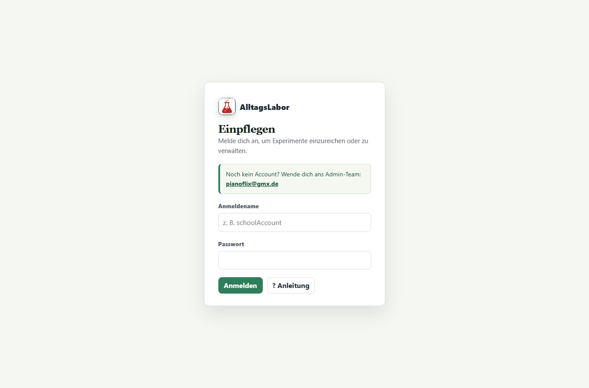

### Zweck

Die Einpflegemaske dient dazu, neue Experimente zu erfassen oder vorhandene Experimente zu bearbeiten. Sie erzeugt Experimentdaten im passenden Format und sendet sie an ein Serverless-Backend.

### Bedienung

1. Account und Passwort eintragen.
2. Sprache und Aktion waehlen.
3. Titel, Kurzbeschreibung, Fach, Klassenstufe und Schulform ausfuellen.
4. Experiment-Schritte anlegen.
5. Je Schritt Typ waehlen, zum Beispiel Text, Aufgabe, Merksatz, Bild oder Audio.
6. Vorschau pruefen.
7. Einreichen.

### Rollen

- `devTeam`: erstellen, bearbeiten und loeschen.
- `academicTest`: erstellen und bearbeiten.
- `schoolAccount`: erstellen.

### Hinweise

Die Maske allein ersetzt keine serverseitige Pruefung. Ein Cloudflare Worker validiert Zugangsdaten und startet danach einen GitHub-Workflow, der Pull Requests im Datenrepository erzeugt.

---

## Digitales Arbeitsblatt: Der Jenaer Wald und wir

Pfad:

```text
src/modules/DAB_naturerlebniszentrum/index.html
```

Screenshot:


### Zweck

Dieses Modul ist ein digitales Arbeitsblatt fuer einen Workshop zur Geschichte des Jenaer Waldes. Im Mittelpunkt stehen historische Waldberufe und die Frage, wie Menschen frueher mit Wald, Rohstoffen und Handwerk gearbeitet haben.

### Bedienung

1. Arbeitsblatt oeffnen.
2. Die Stationen der Reihe nach bearbeiten.
3. Berufe und Materialien erkunden.
4. Texte, Bilder und Arbeitsauftraege lesen.
5. Notizen oder Ergebnisse im vorgesehenen Arbeitsbereich sammeln.
6. Je nach Unterrichtssituation Ergebnisse sichern, besprechen oder weiterverarbeiten.

### Typische Nutzung

- Workshop im Naturerlebniszentrum.
- Geschichts- oder Sachunterricht.
- Gruppenarbeit zu historischen Berufen.
- Vorbereitung eines Posters oder einer Ergebnisvorstellung.

### Hinweise

Das Modul ist als Lernpfad gedacht. Es funktioniert am besten, wenn Lehrkraft oder Workshopleitung kurz erklaeren, welche Stationen Pflicht sind und welche als Zusatz dienen.

---

## AlgoDat-Kurs

Pfad:

```text
src/modules/AlgoDatCourse/index.html
```

Screenshot:

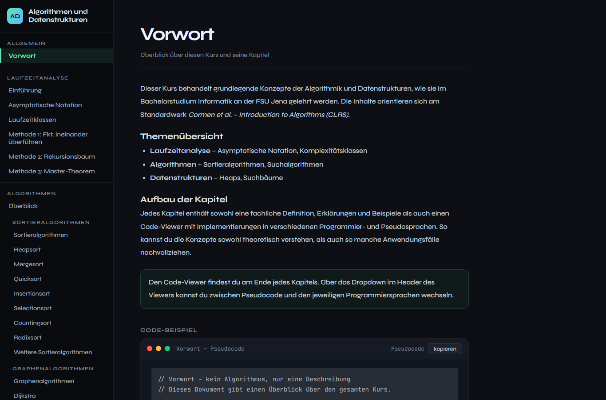

### Zweck

Der AlgoDat-Kurs ist ein interaktiver Selbstlernkurs zu Algorithmen und Datenstrukturen. Er richtet sich an Studierende oder Lernende, die Inhalte aus Algorithmen-und-Datenstrukturen-Vorlesungen wiederholen, vertiefen oder eigenstaendig erschliessen wollen.

### Inhalte

Der Kurs behandelt unter anderem:

- asymptotische Laufzeit,
- Sortierverfahren,
- Heaps,
- Suchbaeume,
- Hashing,
- Union-Find,
- Graphen,
- kuerzeste Wege,
- minimale Spannbaeume,
- Beispielimplementierungen.

### Bedienung

1. Kursseite oeffnen.
2. Kapitel oder Themenbereich waehlen.
3. Theorieabschnitt lesen.
4. Visualisierungen und Beispiele betrachten.
5. Bei passenden Themen ins DatastructureLab wechseln.
6. Codebeispiele und Pseudocode nutzen, um Algorithmen nachzuvollziehen.

### Typische Nutzung

- Klausurvorbereitung.
- Wiederholung einzelner Algorithmen.
- Begleitung einer Vorlesung.
- Nachschlagen von Begriffen.

---

## DatastructureLab

Pfad:

```text
src/modules/AlgoDatCourse/DatastructureLab.html
```

Screenshot:


Weitere Live-Screenshots:

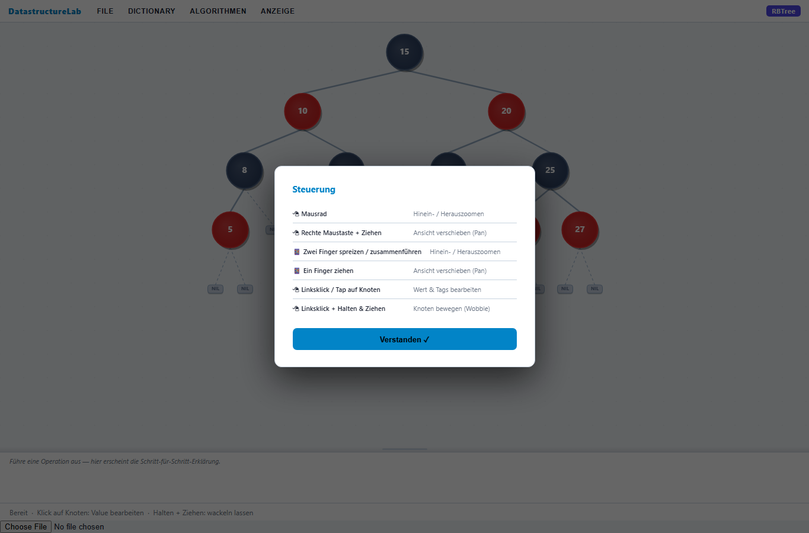

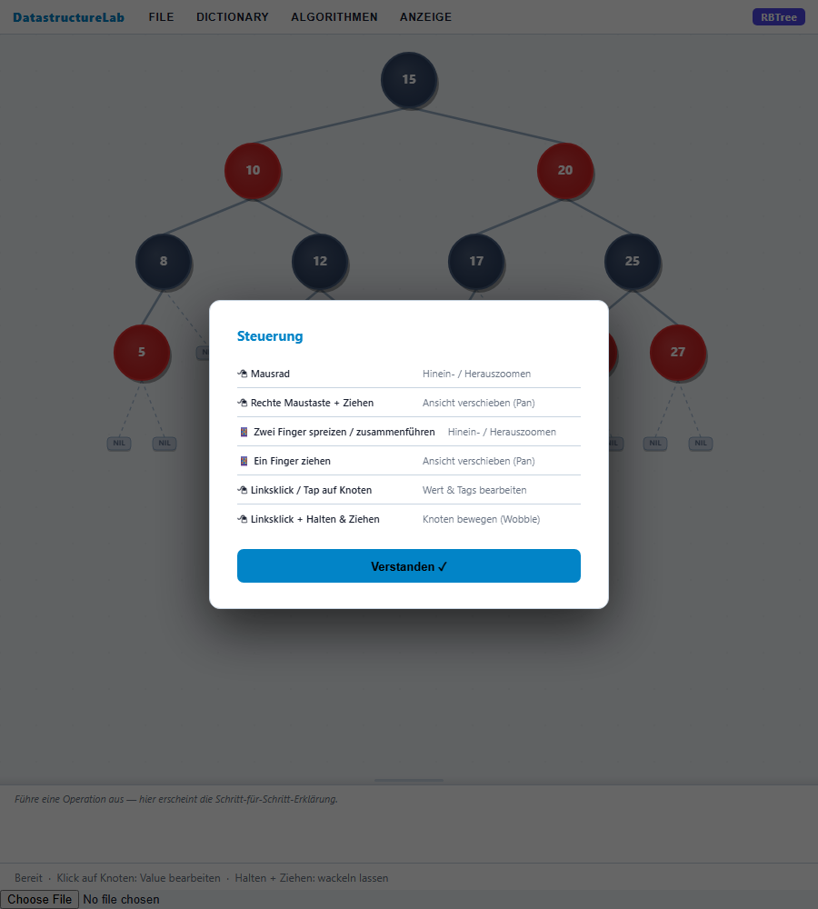


### Zweck

DatastructureLab ist ein interaktives Labor fuer Datenstrukturen und Algorithmen. Es ist nicht nur eine Demo-Seite, sondern ein Arbeitswerkzeug: Man waehlt eine Struktur aus, gibt Daten ein, fuehrt Operationen aus und beobachtet, wie sich Darstellung, Speicherbild, Hilfsstrukturen und Ergebnis veraendern.

Das Lab hilft besonders dann, wenn eine Datenstruktur zwar formal verstanden wurde, aber noch nicht klar ist, was eine Operation konkret veraendert. Statt nur Definitionen wie "Heap-Eigenschaft", "Hash-Kollision" oder "Pfadkompression" zu lesen, kann man Beispiele erzeugen und Schritt fuer Schritt untersuchen.

### Grundidee der Arbeit mit dem Lab

Man sollte mit dem DatastructureLab wie mit einem Experimentierkasten arbeiten:

1. Eine Datenstruktur oder einen Algorithmus auswaehlen.
2. Einen kleinen, ueberschaubaren Datensatz eingeben.
3. Eine einzelne Operation ausfuehren.
4. Erst beobachten, dann erklaeren.
5. Das Beispiel leicht veraendern.
6. Wieder beobachten.
7. Danach erst groessere Beispiele testen.

Gute Beispiele sind am Anfang klein. Fuer einen Heap reichen 5 bis 8 Zahlen. Fuer Hashing reichen 6 bis 10 Schluessel. Fuer Graphalgorithmen reichen 4 bis 6 Knoten. Zu grosse Beispiele sehen beeindruckend aus, verdecken aber oft die eigentliche Idee.

### Bedienung

1. **Labor oeffnen:** `src/modules/AlgoDatCourse/DatastructureLab.html` im Browser starten.
2. **Struktur auswaehlen:** Im Auswahlbereich die gewuenschte Datenstruktur oder den Algorithmus waehlen.
3. **Daten eingeben:** Werte, Knoten, Kanten oder Schluessel eintragen. Wenn Beispielbuttons vorhanden sind, zuerst ein Beispiel laden.
4. **Operation waehlen:** Eine Operation wie Insert, Delete, Search, Heapify, Union, Find, Dijkstra, Prim oder Kruskal ausfuehren.
5. **Visualisierung lesen:** Nicht sofort weiterklicken, sondern die Veraenderung der Struktur betrachten.
6. **Speicherbild betrachten:** Wenn ein Array-, Tabellen- oder Memory-Viewer angezeigt wird, dort pruefen, wie die abstrakte Struktur intern abgelegt ist.
7. **Hilfsstrukturen beachten:** Bei Graphalgorithmen zum Beispiel Priority Queue, Union-Find oder Distanzwerte beobachten.
8. **Operationslog lesen:** Falls ein Log oder Statusbereich angezeigt wird, diesen mit der Visualisierung vergleichen.
9. **Hypothese testen:** Vor der naechsten Operation ueberlegen, was passieren muesste, und erst danach klicken.
10. **Beispiel dokumentieren:** Fuer Lernzwecke die Eingabe, Operation und Beobachtung notieren.

### Empfohlener Lernworkflow

Ein sinnvoller Ablauf fuer eine Lerneinheit sieht so aus:

1. **Theorie im AlgoDat-Kurs lesen.**
   Beispiel: erst den Abschnitt zu Heaps, Hashing oder Graphalgorithmen lesen.
2. **Begriff in InfoPedia nachschlagen.**
   Dort Definition, Operationen und Beweisidee wiederholen.
3. **Im DatastructureLab ein kleines Beispiel bauen.**
   Nicht direkt mit komplizierten Daten beginnen.
4. **Operationen einzeln ausfuehren.**
   Immer nur eine Operation betrachten.
5. **Ergebnis mit der Theorie vergleichen.**
   Stimmt die Heap-Eigenschaft? Wurde der richtige Slot beim Hashing gefunden? Ist die MST-Kante plausibel?
6. **Grenzfall testen.**
   Zum Beispiel doppelte Werte, leere Struktur, Kollisionen, unverbundene Graphen oder gleiche Kantengewichte.
7. **In eigenen Worten erklaeren.**
   Wenn man das Ergebnis ohne Hilfe erklaeren kann, ist der Algorithmus meist wirklich verstanden.

### Typische Workflows

#### 1. Heap verstehen

Ziel: Verstehen, warum ein Heap als Array gespeichert werden kann und wie Insert oder Extract das Array veraendern.

Vorgehen:

1. Heap-Struktur auswaehlen.
2. Werte wie `7, 3, 10, 1, 5, 8` eingeben.
3. Build-Heap oder Insert-Schritte ausfuehren.
4. Im Baum schauen, welcher Wert Eltern- oder Kindknoten ist.
5. Im Speicherbild pruefen, an welcher Array-Position derselbe Wert steht.
6. Extract-Min oder Extract-Max ausfuehren.
7. Beobachten, welcher Wert an die Wurzel wandert und welche Tauschoperationen passieren.

Worauf achten:

- Ein Heap ist kein sortiertes Array.
- Nur die Heap-Eigenschaft ist garantiert.
- Die Wurzel ist besonders wichtig, weil dort Minimum oder Maximum liegt.
- Die Array-Indizes erklaeren die Eltern-Kind-Beziehungen.

#### 2. Hashing und Kollisionen untersuchen

Ziel: Verstehen, warum Hashfunktionen Kollisionen erzeugen koennen und wie die Tabelle damit umgeht.

Vorgehen:

1. Hash-Tabelle auswaehlen.
2. Tabellengroesse klein halten, zum Beispiel 7 oder 11.
3. Mehrere Schluessel einfuegen.
4. Gezielt Werte waehlen, die auf denselben Slot fallen.
5. Search fuer vorhandene und nicht vorhandene Schluessel testen.
6. Delete ausfuehren, wenn die Struktur es anbietet.
7. Beobachten, ob Verkettung, offene Adressierung oder Markierungen verwendet werden.

Worauf achten:

- Eine gute Hashfunktion verteilt Schluessel moeglichst gleichmaessig.
- Kollisionen sind normal, kein Fehler.
- Bei offener Adressierung ist die Suchfolge wichtig.
- Bei Delete darf die spaetere Suche nicht kaputtgehen.

#### 3. Union-Find beobachten

Ziel: Verstehen, wie Mengen zusammengelegt werden und warum Pfadkompression spaeter schneller macht.

Vorgehen:

1. Union-Find bzw. Disjoint Set auswaehlen.
2. Einzelne Elemente anlegen.
3. Mehrere Union-Operationen ausfuehren, zum Beispiel `union(1,2)`, `union(2,3)`, `union(4,5)`.
4. Find auf verschiedenen Elementen ausfuehren.
5. Vor und nach Find pruefen, ob sich Elternzeiger veraendern.
6. Wenn Rank oder Size angezeigt wird, diese Werte beobachten.

Worauf achten:

- Union-Find speichert Mengen nicht als Listen, sondern als Wald von Elternzeigern.
- `find(x)` liefert den Repraesentanten der Menge.
- Pfadkompression veraendert die Struktur, obwohl nur gesucht wird.
- Union by Rank oder Size verhindert unnoetig tiefe Baeume.

#### 4. Dijkstra nachvollziehen

Ziel: Verstehen, wie kuerzeste Wege mit nichtnegativen Kantengewichten gefunden werden.

Vorgehen:

1. Graphbereich oeffnen.
2. Kleinen gewichteten Graphen mit 4 bis 6 Knoten anlegen.
3. Startknoten waehlen.
4. Dijkstra ausfuehren.
5. Distanzwerte beobachten.
6. Priority Queue oder Heap als Hilfsstruktur beachten, wenn sie angezeigt wird.
7. Pruefen, welcher Knoten als naechstes fest gewaehlt wird.
8. Relaxationen nachvollziehen.

Worauf achten:

- Dijkstra funktioniert nur korrekt mit nichtnegativen Kantengewichten.
- Ein Knoten wird fest, wenn seine aktuell kleinste Distanz sicher ist.
- Relaxation bedeutet: Ein gefundener Weg zu einem Nachbarn wird verbessert.
- Die Priority Queue bestimmt, welcher Knoten als naechstes verarbeitet wird.

#### 5. Prim und Kruskal vergleichen

Ziel: Verstehen, dass beide Algorithmen minimale Spannbaeume finden, aber unterschiedlich arbeiten.

Vorgehen Prim:

1. Gewichteten ungerichteten Graphen anlegen.
2. Startknoten waehlen.
3. Prim ausfuehren.
4. Beobachten, wie der Baum von einem Startpunkt aus waechst.
5. Priority Queue oder Kandidatenkanten betrachten.

Vorgehen Kruskal:

1. Denselben Graphen verwenden.
2. Kruskal ausfuehren.
3. Beobachten, wie Kanten nach Gewicht betrachtet werden.
4. Union-Find-Hilfsstruktur beachten.
5. Pruefen, welche Kanten wegen Zyklusbildung abgelehnt werden.

Worauf achten:

- Prim waechst von einem Startknoten aus.
- Kruskal sortiert Kanten global nach Gewicht.
- Kruskal braucht Union-Find, um Zyklen effizient zu erkennen.
- Beide sollen am Ende einen minimalen Spannbaum liefern, aber nicht zwingend dieselbe Kantenreihenfolge.

#### 6. Baumoperationen Schritt fuer Schritt nachvollziehen

Ziel: Verstehen, wie Suchbaeume, balancierte Baeume oder Traversierungen arbeiten.

Vorgehen:

1. Baumstruktur auswaehlen.
2. Werte in einer bewusst unguenstigen Reihenfolge einfuegen, zum Beispiel sortiert oder fast sortiert.
3. Insert ausfuehren und Baumform beobachten.
4. Search fuer vorhandene und fehlende Werte testen.
5. Delete ausfuehren, wenn verfuegbar.
6. Bei balancierten Baeumen Rotationen oder Farb-/Balanceinformationen beachten.

Worauf achten:

- Suchbaeume leben von ihrer Ordnungseigenschaft.
- Unbalancierte Baeume koennen degenerieren.
- Rotationen veraendern die Form, aber nicht die Inorder-Reihenfolge.
- Traversierungen zeigen, welche Reihenfolge der Baum implizit speichert.

### Aufgabenideen fuer das Arbeiten mit dem Lab

Diese Aufgaben eignen sich fuer Selbststudium oder Unterricht:

- Baue einen Heap aus 8 Zahlen und notiere nach jedem Insert das Array.
- Erzeuge in einer Hash-Tabelle mindestens drei Kollisionen und erklaere, wie sie aufgeloest werden.
- Fuehre `find` in Union-Find vor und nach Pfadkompression aus und vergleiche die Elternzeiger.
- Erstelle einen Graphen, bei dem Dijkstra mehrere Distanzwerte verbessert, bevor ein Knoten fest wird.
- Vergleiche Prim und Kruskal auf demselben Graphen.
- Suche ein Beispiel, bei dem zwei unterschiedliche minimale Spannbaeume moeglich sind.
- Erzeuge einen Suchbaum mit sortierter Eingabe und erklaere, warum das unguenstig ist.
- Erstelle einen Screenshot vor und nach einer Operation und beschrifte die Veraenderung.

### Typische Fehler beim Arbeiten

| Problem | Ursache | Loesung |
| --- | --- | --- |
| Die Visualisierung wirkt chaotisch | Beispiel ist zu gross | Mit weniger Werten starten |
| Erwartetes Ergebnis stimmt nicht | Operation oder Struktur verwechselt | Erst pruefen, ob Min-Heap, Max-Heap, BST, Hashing usw. gewaehlt ist |
| Graphalgorithmus liefert kein sinnvolles Ergebnis | Graph ist gerichtet/ungerichtet oder gewichtet/ungewichtet falsch modelliert | Kanten und Gewichte kontrollieren |
| Dijkstra verhaelt sich unerwartet | Negative Kantengewichte oder falscher Startknoten | Nur nichtnegative Gewichte verwenden und Startknoten pruefen |
| Hash-Suche bricht scheinbar zu frueh ab | Delete-/Open-Addressing-Regel nicht beachtet | Markierungen und Suchfolge anschauen |
| Union-Find sieht nach `find` anders aus | Pfadkompression veraendert Elternzeiger | Das ist Absicht und Teil der Optimierung |

### Wie man Ergebnisse dokumentiert

Fuer Lern- oder Abgabezwecke sollte man nicht nur schreiben "Ich habe Dijkstra ausgefuehrt". Besser ist:

1. Eingabedaten nennen.
2. Gewaehlte Struktur nennen.
3. Operation nennen.
4. Beobachtung beschreiben.
5. Ergebnis mit Theorie verbinden.

Beispiel:

```text
Struktur: Union-Find
Eingabe: Elemente 1 bis 6
Operationen: union(1,2), union(2,3), find(3)
Beobachtung: Nach find(3) zeigt 3 direkter auf den Repraesentanten.
Erklaerung: Das ist Pfadkompression. Sie beschleunigt spaetere find-Aufrufe.
```

### Hinweise

Das Modul ist besonders nuetzlich, wenn man eine Datenstruktur nicht nur als Definition, sondern als veraenderbares Objekt verstehen will. Der wichtigste Tipp lautet: nicht zu schnell klicken. Nach jeder Operation sollte man kurz erklaeren koennen, warum die neue Darstellung korrekt ist. Wenn das nicht gelingt, ist genau diese Stelle der richtige Lernpunkt.

---

## InfoPedia

Pfad:

```text
src/modules/AlgoDatCourse/infopedia.html
```

Screenshot:

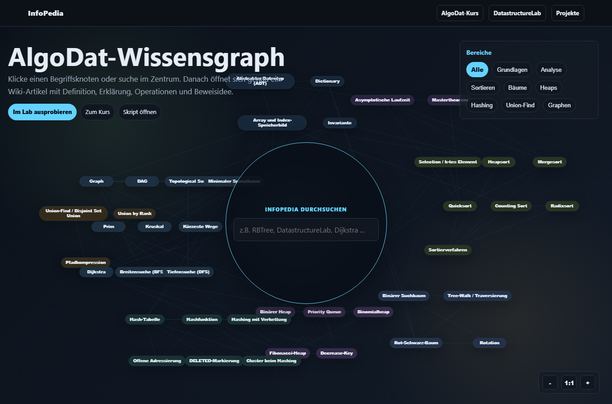

### Zweck

InfoPedia ist ein Wissensgraph zu Begriffen aus Algorithmen, Datenstrukturen und Website-Inhalten. Begriffe sind als Knoten organisiert und koennen durchsucht, gefiltert und als Artikel geoeffnet werden.

### Bedienung

1. InfoPedia oeffnen.
2. Begriff in die Suche eingeben oder einen Knoten anklicken.
3. Artikel mit Definition, Erklaerung, Operationen und Beweisidee lesen.
4. Ueber verwandte Begriffe weiter navigieren.
5. Zoom- und Filterfunktionen nutzen.

### Typische Nutzung

- Begriff schnell nachschlagen.
- Zusammenhang zwischen Algorithmen sehen.
- Vom Kurs ins Lab wechseln.
- Projekt- und Tool-Eintraege der Website finden.

---

## AutomataLab

Pfad:

```text
src/modules/AutomataLab/index.html
```

Screenshot:

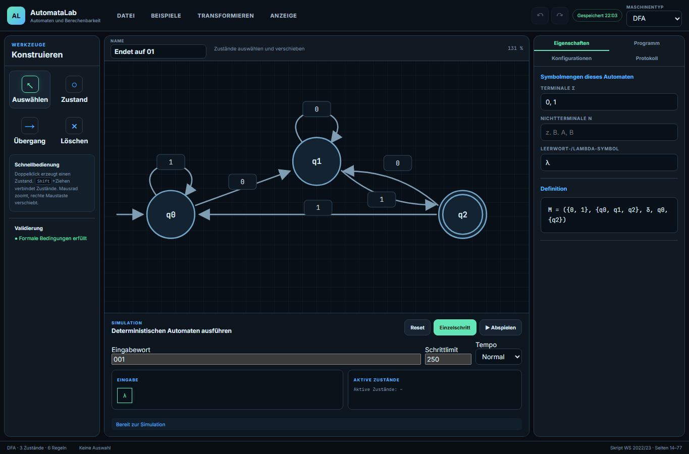

### Zweck

AutomataLab ist ein Werkzeug zum Konstruieren, Simulieren und Transformieren formaler Automaten. Es passt zu Themen wie DFA, NFA, Kellerautomaten, Turingmaschinen, regulaere Sprachen und Berechenbarkeit.

### Bedienung

1. Automatenmodell waehlen.
2. Zustaende auf der Arbeitsflaeche anlegen.
3. Start- und Endzustaende markieren.
4. Transitionen eintragen.
5. Eingabewort testen.
6. Simulation starten und Schritt fuer Schritt verfolgen.
7. Automaten speichern, exportieren oder weiterbearbeiten.

### Typische Nutzung

- DFA/NFA im Unterricht demonstrieren.
- Akzeptanz eines Wortes testen.
- Transitionen visuell korrigieren.
- Automatenmodelle fuer Aufgaben bauen.

### Hinweise

Bei formalen Modellen ist es wichtig, die Uebergangsbeschriftungen exakt zu setzen. Kleine Tippfehler veraendern bereits die erkannte Sprache.

---

## GVIS

Pfad:

```text
src/modules/GVIS/index.html
```

Screenshot:

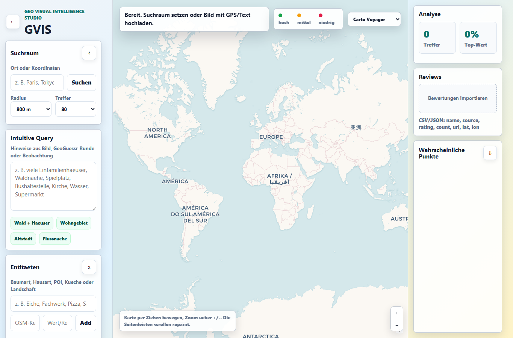

### Zweck

GVIS ist ein statisches GIS-Werkzeug fuer OSM-, GeoJSON- und CSV-Daten. Es kann Orte, Vegetation, Gebaeude, Wege und POIs auswerten und in einer Kartenansicht sichtbar machen.

### Bedienung

1. GVIS oeffnen.
2. Datentyp oder Analysemodus waehlen.
3. Datenquelle laden oder Beispiel verwenden.
4. Query beziehungsweise Suchlogik formulieren.
5. Ergebnisse auf der Karte betrachten.
6. Bewertung oder wahrscheinliche Punkte analysieren.

### Typische Nutzung

- Geodaten explorieren.
- OpenStreetMap-Daten fuer Unterricht oder Projekte auswerten.
- Hinweise fuer GeoGuessr-aehnliche Analysen sammeln.
- POIs oder Flaechen vergleichen.

---

## Regie Wall

Pfad:

```text
src/modules/regie/index(1).html
```

### Zweck

Die Regie Wall ist eine browserbasierte Kontrollwand fuer mehrere Quellen. Sie kann Websites, Login-Seiten, YouTube-Videos, HLS-Streams und lokale IPv4-/LAN-Dienste in Monitor-Kacheln anordnen. Das Modul ist besonders fuer Vorfuehrungen, Regiesituationen, Stream-Setups oder lokale Kontrollanzeigen gedacht.

### Bedienung

1. Regie Wall oeffnen.
2. Anzahl der Monitore waehlen.
3. Preset auswaehlen, zum Beispiel Grid oder Program + Preview.
4. Im Menue Quellen eintragen oder Sender/Streams auswaehlen.
5. Kacheln verschieben, skalieren und bei Bedarf in den Vollbildmodus wechseln.
6. Audio mit Mute, Solo und Lautstaerke-Reglern kontrollieren.

### Hinweise

Loopback-Quellen wie `http://127.0.0.1:8000`, `http://localhost:8000` und lokale LAN-Quellen wie `http://192.168.x.x` werden auch aus der GitHub-Pages-Version direkt als Frame versucht. Die Wall setzt dafuer `local-network-access` am iframe und kann die Browserfreigabe ueber `Browser-Freigabe anstossen` aktiv anfragen; aktuelle Chromium-/Edge-Browser koennen trotzdem eine lokale Netzwerkfreigabe verlangen. Wenn der Browser blockiert oder die Zielseite Frames verbietet, gibt es den Local-Mode:

```text
src\modules\regie\start-local-regie-wall.bat
```

Das Script startet einen lokalen HTTP-Server im Repository-Root und oeffnet:

```text
http://127.0.0.1:8765/src/modules/regie/index(1).html
```

Wenn die Regie Wall bereits ueber GitHub Pages offen ist, kann der Button `Lokale Regie mit Setup oeffnen` das aktuelle Setup an diese lokale URL uebergeben. Danach koennen lokale IPv4-/LAN-Webseiten als normale Frames geladen werden, sofern die Zielseite selbst Frames erlaubt.

### Typische Nutzung

- Mehrere Streams oder Webseiten parallel ueberwachen.
- Program- und Preview-Ansichten fuer Vorfuehrungen aufbauen.
- Lokale Geraete, Kameras oder Webinterfaces in einer Wand sammeln.
- Soundboard und Audio-Steuerung fuer einfache Regiesituationen nutzen.

---

## AlgorithmPlanner

Pfad:

```text
src/modules/AlgorithmPlanner/index.html
```

Screenshot:

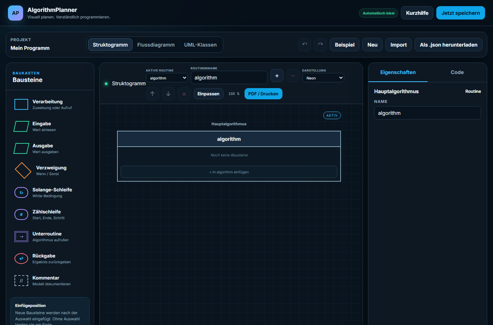

### Zweck

AlgorithmPlanner ist ein visueller Baukasten zum Modellieren von Programmablaeufen. Er kann Struktogramme, Flussdiagramme und UML-artige Modelle unterstuetzen und daraus Code fuer verschiedene Programmiersprachen generieren.

### Bedienung

1. Neues Projekt oder Modell oeffnen.
2. Ablaufbausteine einfuegen.
3. Bedingungen, Schleifen oder Anweisungen konfigurieren.
4. Ansicht zwischen Strukturmodell, Flowchart oder UML wechseln.
5. Codegenerierung fuer die passende Sprache nutzen.
6. Projekt speichern oder exportieren.

### Typische Nutzung

- Algorithmus vor dem Programmieren planen.
- Unterricht zu Kontrollstrukturen vorbereiten.
- Von Pseudocode zu echtem Code ueberleiten.
- Ablaufplaene dokumentieren.

---

## TI-Trainer

Pfad:

```text
src/modules/titrainer/index.html
```

Screenshot:

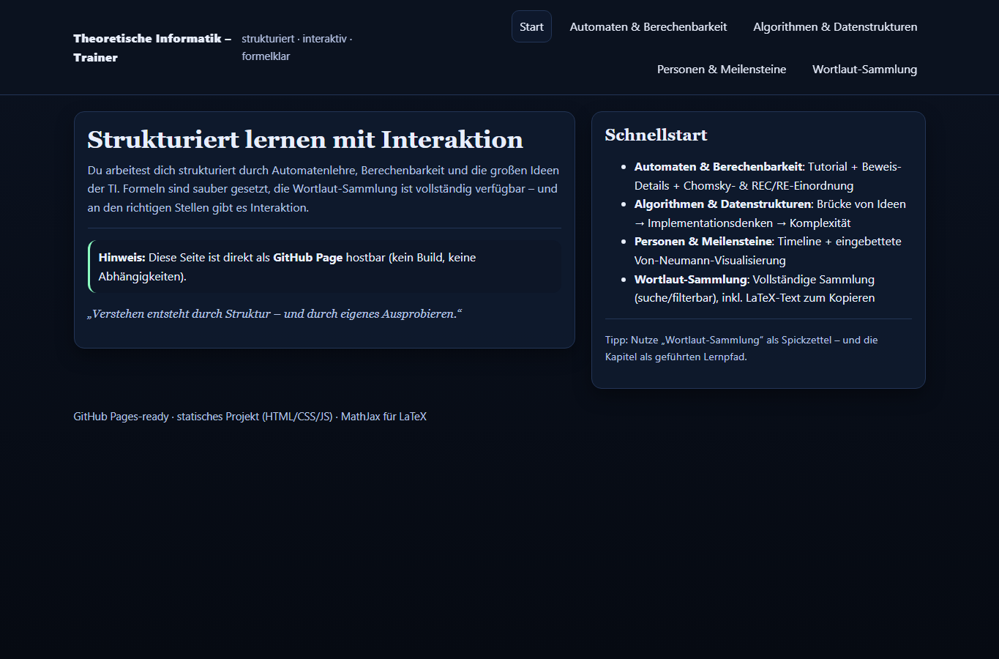

### Zweck

Der TI-Trainer ist eine Lernumgebung zur Technischen Informatik. Er buendelt Themen wie Automaten, Algorithmen und Datenstrukturen, Personen der Informatik und Von-Neumann-Architektur.

### Bedienung

1. Startseite des TI-Trainers oeffnen.
2. Lernbereich waehlen.
3. Theorie, Beispiele und interaktive Elemente bearbeiten.
4. Bei Automaten oder Von-Neumann-Themen in die jeweiligen Unterseiten wechseln.

### Wichtige Unterseiten

- `src/modules/titrainer/automaten.html`
- `src/modules/titrainer/personen.html`
- `src/modules/titrainer/rote-boxen.html`
- `src/modules/titrainer/sim/index.html`
- `src/modules/titrainer/vna/index.html`

### Typische Nutzung

- Einstieg in technische Informatik.
- Wiederholung formaler Modelle.
- Begleitung von Unterrichtssequenzen.
- Nachschlagen historischer Personen und Meilensteine.

---

## Markdown-Generator

Pfad:

```text
src/modules/markdownGenerator/index.html
```

Screenshot:

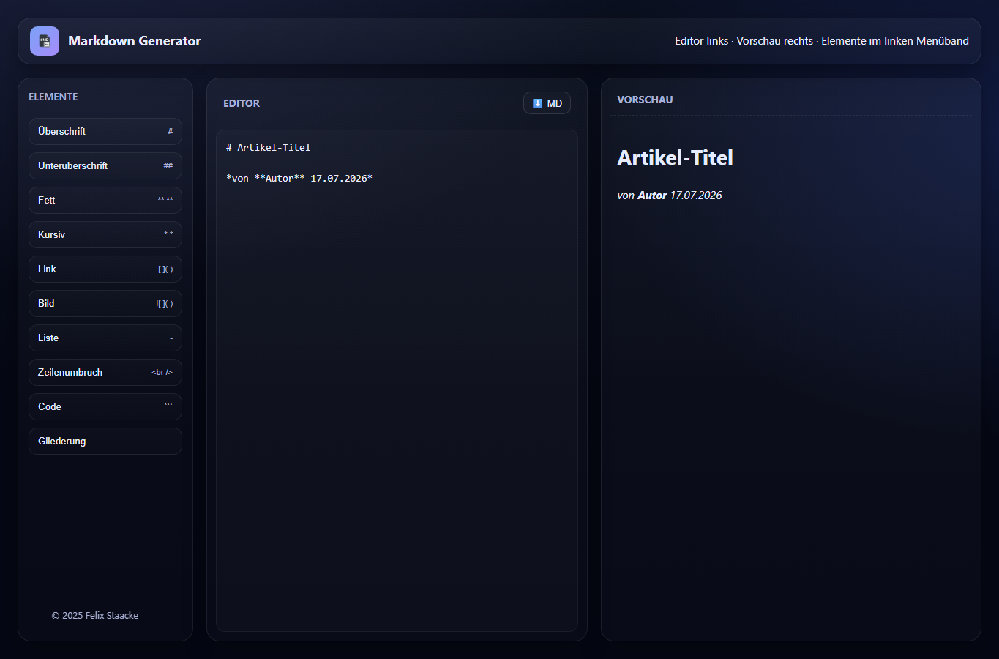

### Zweck

Der Markdown-Generator ist eine Webanwendung zum Erzeugen von Markdown-Dateien per Baukastenprinzip. Er richtet sich an Nutzerinnen und Nutzer, die Markdown-Strukturen erstellen wollen, ohne jede Syntax auswendig zu kennen.

### Bedienung

1. Modul oeffnen.
2. Markdown-Element auswaehlen, zum Beispiel Ueberschrift, Liste, Link oder Codeblock.
3. Inhalte eingeben.
4. Vorschau oder generierten Markdown pruefen.
5. Ergebnis kopieren oder herunterladen, je nach verfuegbarer Funktion.

### Typische Nutzung

- README-Dateien vorbereiten.
- Unterrichtsmaterial strukturieren.
- Markdown-Syntax lernen.
- Kleine Dokumentationen erzeugen.

---

## QR-Generator

Pfad:

```text
src/modules/qrgenerator/index.html
```

Screenshot:

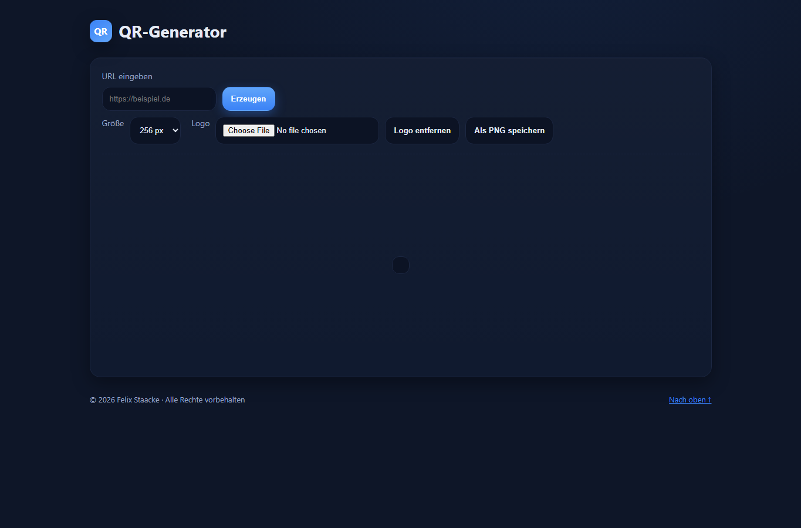

### Zweck

Der QR-Generator erzeugt QR-Codes aus Texten oder URLs. Er ist fuer Unterricht, Projektpraesentationen, Aushangmaterialien oder schnelle Linkweitergabe geeignet.

### Bedienung

1. Ziel-URL oder Text eingeben.
2. QR-Code generieren.
3. Groesse und Darstellung anpassen.
4. Optional Logo oder zentrales Bild verwenden, wenn die Funktion aktiv ist.
5. QR-Code speichern oder weiterverwenden.

### Typische Nutzung

- Link zu einer Projektseite teilen.
- Arbeitsblatt mit QR-Code ausstatten.
- Stationenlernen vorbereiten.
- Materialien fuer Praesentationen erstellen.

---

## Scrum 4 School

Pfad:

```text
src/modules/scrum4school/index.html
```

Screenshot:

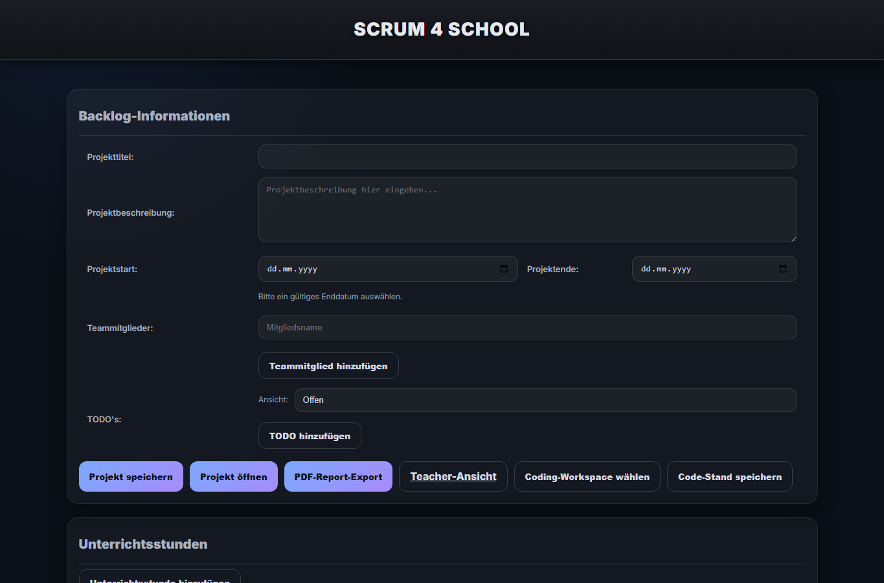

### Zweck

Scrum 4 School ist eine Webanwendung zum strukturierten Arbeiten in Unterrichts- oder Projektkontexten. Lernende koennen Aufgaben, Sprints, Projektinformationen und Fortschritt erfassen.

### Bedienung

1. Projekt anlegen.
2. Projekttitel und Beschreibung eintragen.
3. Teammitglieder oder Rollen erfassen.
4. Aufgaben und Sprints anlegen.
5. Arbeitsstand dokumentieren.
6. Daten exportieren oder sichern, wenn die jeweilige Funktion genutzt wird.

### Typische Nutzung

- Projektarbeit im Unterricht organisieren.
- Gruppenarbeit strukturieren.
- Sprints und Aufgaben sichtbar machen.
- Reflexion und Arbeitsfortschritt dokumentieren.

---

## Scrum 4 School Teacher

Pfad:

```text
src/modules/scrum4school/teacher.html
```

Screenshot:

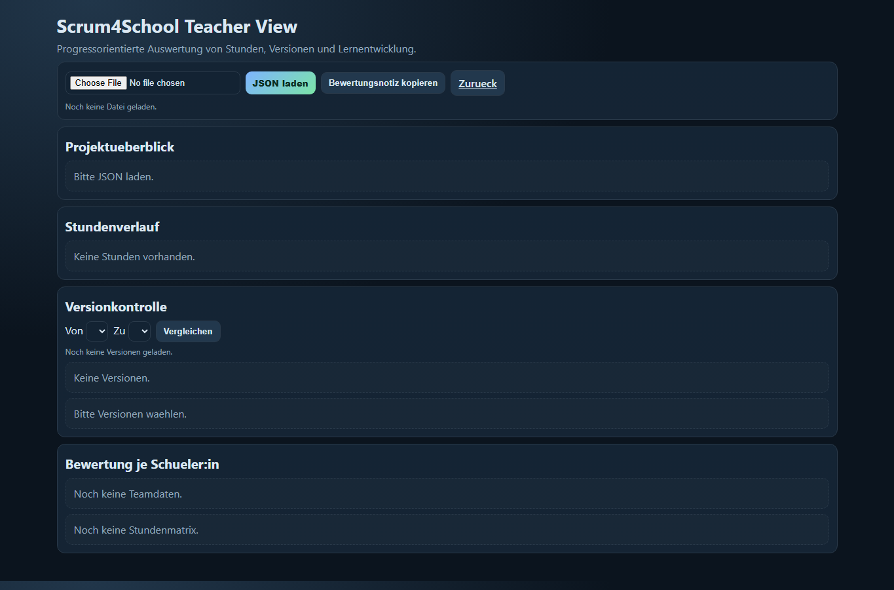

### Zweck

Die Teacher-Ansicht dient der Auswertung oder Einsicht in exportierte Scrum-4-School-Projektdaten. Sie ist als Hilfsansicht fuer Lehrkraefte gedacht.

### Bedienung

1. Teacher-Seite oeffnen.
2. Exportierte JSON-Datei laden.
3. Projektuebersicht, Aufgaben, Sprints oder Logeintraege betrachten.
4. Hinweise fuer Bewertung oder Rueckmeldung ableiten.

---

## School-Notebook

Pfad:

```text
src/modules/SchoolNotebook/index.html
```

Screenshot:

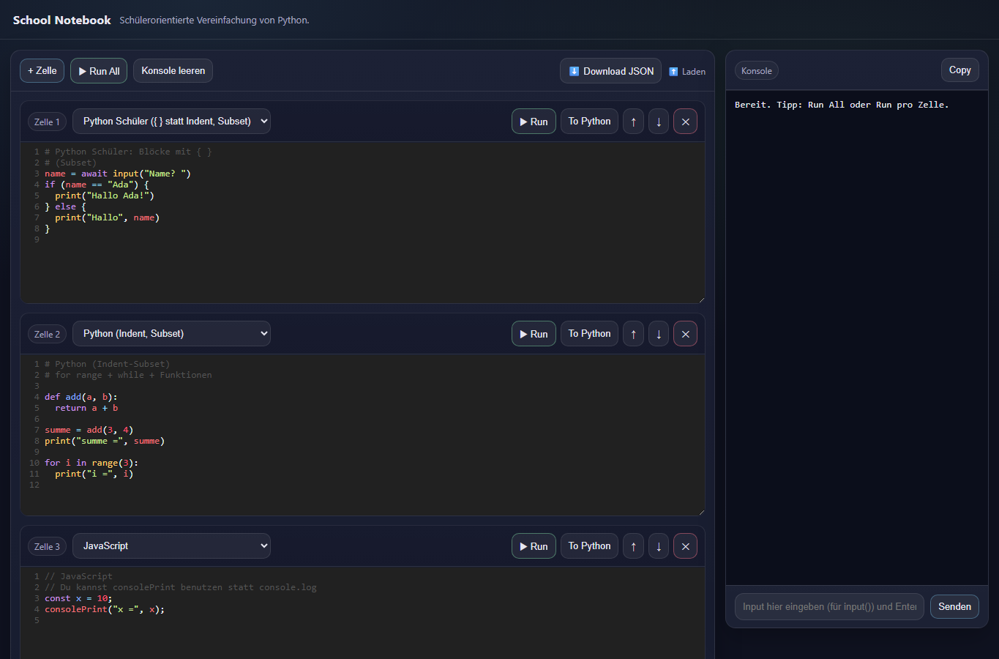

### Zweck

School-Notebook ist eine Web-IDE mit Konsole fuer eine Python-aehnliche Lernsprache. Es imitiert typische Programmierumgebungen, ist aber auf Lernkontexte zugeschnitten.

### Bedienung

1. Notebook oeffnen.
2. Code in den Editor schreiben.
3. Programm ausfuehren.
4. Ausgabe in der Konsole betrachten.
5. Fehler korrigieren und erneut testen.

### Typische Nutzung

- Einstieg in Programmierlogik.
- Uebungen zu Variablen, Ausgaben und Bedingungen.
- Unterricht mit einer reduzierten, kontrollierten Umgebung.
- Demonstrationen ohne lokale Python-Installation.

---

## TIVisualizer

Pfad:

```text
src/modules/tivisualiser/index.html
```

Screenshot:

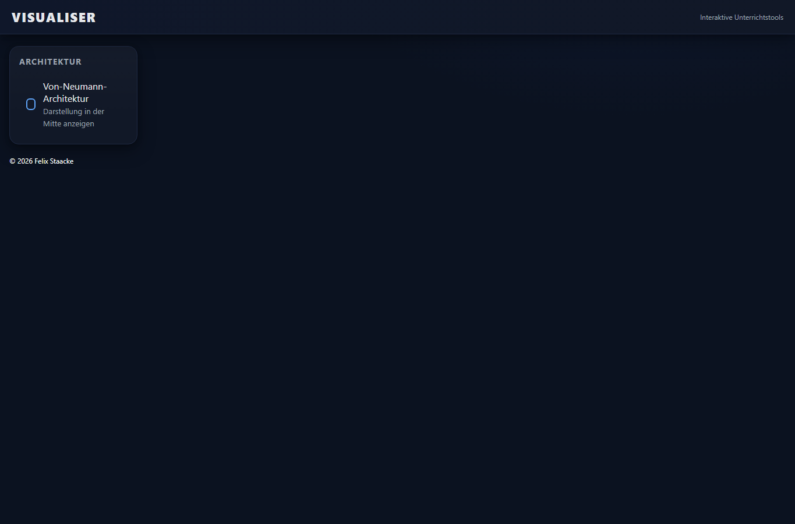

### Zweck

TIVisualizer visualisiert die Von-Neumann-Architektur. Nutzerinnen und Nutzer koennen einzelne Komponenten anklicken und deren Rolle im Rechneraufbau nachvollziehen.

### Bedienung

1. Visualisierung oeffnen.
2. Komponente anklicken.
3. Erklaerung lesen.
4. Zwischen Komponenten wechseln.
5. Zusammenhaenge zwischen Speicher, Steuerwerk, Rechenwerk und Ein-/Ausgabe nachvollziehen.

### Typische Nutzung

- Unterrichtseinstieg zur Rechnerarchitektur.
- Wiederholung der Von-Neumann-Architektur.
- Visuelle Erklaerung technischer Informatik.

---

## Meme-Maker

Pfad:

```text
src/modules/memeMaker/index.html
```

Screenshot:

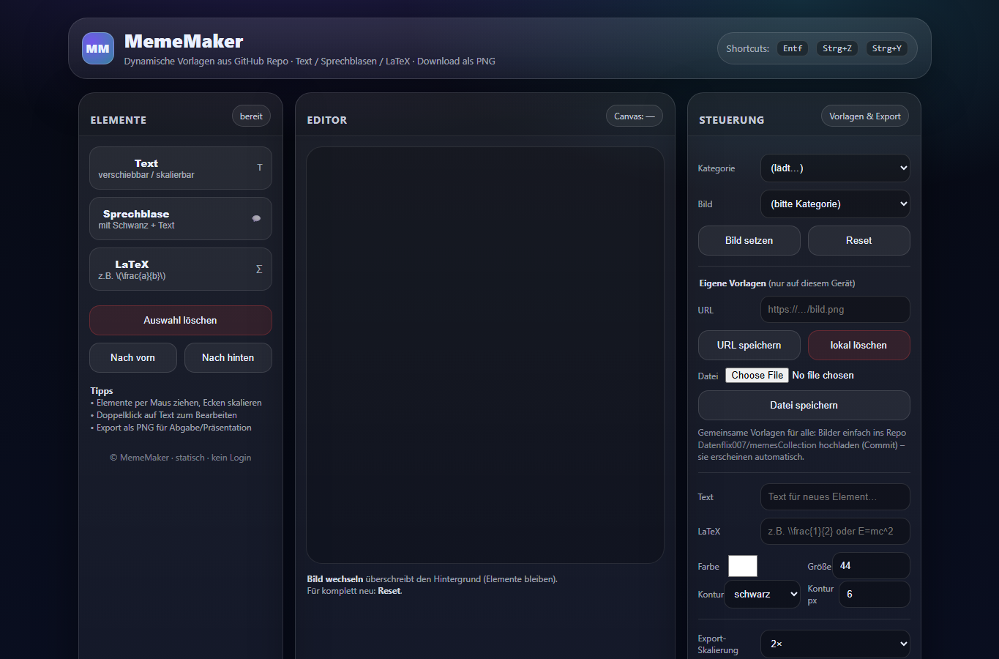

### Zweck

Der Meme-Maker ist ein Tool zum Erstellen und Bearbeiten von Memes. Es ist als kreatives kleines Webtool im Repository enthalten.

### Bedienung

1. Meme-Maker oeffnen.
2. Vorlage oder Bild laden.
3. Textfelder bearbeiten.
4. Positionen und Gestaltung anpassen.
5. Ergebnis exportieren oder speichern, wenn die jeweilige Funktion genutzt wird.

---

## Manuskript-Maker

Pfad:

```text
src/modules/manuscriptMaker/index.html
```

Screenshot:


### Zweck

Der Manuskript-Maker ist ein Tool im Aufbau fuer Manuskriptarbeit. Er ist im Projekt als online nutzbares Modul verlinkt und dient als Experimentierflaeche fuer strukturierte Schreib- oder Manuskriptprozesse.

### Bedienung

1. Modul oeffnen.
2. Vorhandene Bedienelemente testen.
3. Inhalte oder Manuskriptabschnitte eintragen, sofern die Funktion aktiv ist.
4. Ergebnis pruefen und ggf. exportieren.

---

## Wenn Zeit Leben rettet

Pfad:

```text
src/modules/WennZeitÜberLebenEntscheidet/index.html
```

Screenshot:

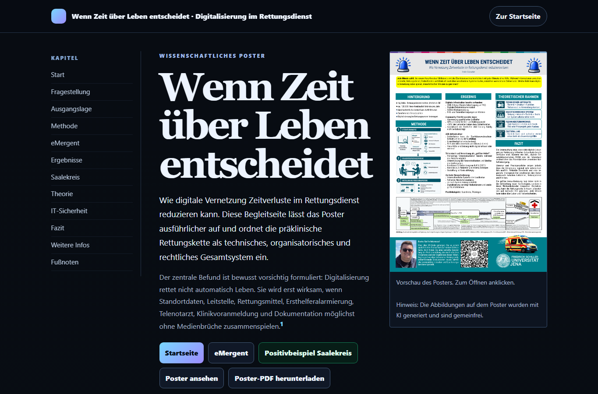

### Zweck

Diese Seite dokumentiert ein wissenschaftliches Poster und einen begleitenden Text zur Digitalisierung in der praeklinischen Notfallmedizin. Im Mittelpunkt steht die Frage, wie digitale Systeme Rettungsdienst, Klinikkommunikation und Einsatzablaeufe beeinflussen koennen.

### Bedienung

1. Artikel oeffnen.
2. Einleitung und Analyse lesen.
3. Poster oder Poster-Viewer oeffnen, wenn der direkte Posterblick benoetigt wird.
4. Quellen und Fussnoten nachvollziehen.

### Typische Nutzung

- Nachlesen des Posters.
- Kontext fuer eine Praesentation.
- Einstieg in ein Thema aus Informatik und Gesellschaft.

## Guides und Handbuecher

Die Guides liegen unter:

```text
src/guides/
```

Sie werden ueber `src/weitere-guides.html` und `src/projekte.html` sichtbar gemacht.


### Installer Guide

Pfad:

```text
src/guides/installer-guide.html
```

Screenshot:


Der Installer Guide erklaert, wie eigene Java- oder Python-Projekte installierbar gemacht werden. Er behandelt Windows, Linux, PyInstaller, Inno Setup, `jpackage`, `.desktop`-Dateien, Tkinter-Installer, CLI-Installer und Prompt-Vorlagen fuer Coding Agents.

### Weitere Guides

- `src/guides/programm-exe-erstellen.html`: Programm.exe-Dateien aus Python-, Java-, C#-, Node.js-, Go- und Rust-Projekten bauen.
- `src/guides/pake.html`: Webseiten als Desktop-Apps verpacken.
- `src/guides/redis-caching.html`: Redis-Caching verstehen und einsetzen.
- `src/guides/just.html`: Projektbefehle mit `just` automatisieren.
- `src/guides/winget.html`: Windows Package Manager nutzen.
- `src/guides/scheme-guide.html`: Scheme/Racket von Grundlagen bis Praedikate.
- `src/guides/prolog-dummies.html`: Einstieg in Prolog.
- `src/modules/GitHubCourse/github-kurs.html`: Kurs zu Git, GitHub und GitLab.

## Extern gelistete Projekte

Einige Karten verweisen auf externe Repositories statt auf direkt gehostete Module:

- `Datenflix007/JenaTramBoard`
- `Datenflix007/Basic-Knowledge-Graph`
- `Datenflix007/MySQL_TraineeGround`
- `Datenflix007/PythonPrologInterface`
- `Datenflix007/EinsatzDisponierungSoftware`
- `Datenflix007/L-S`
- `Datenflix007/holo-history`
- `Datenflix007/OCR-Extractor`
- `Datenflix007/zotero-webdav-GithubViaDocker`
- `Datenflix007/TIVisualiser`
- `Datenflix007/jenaCraftImages`
- `Datenflix007/pnp_thesaurusMagistriNaumburgensis`

## Referenzen

Datei:

```text
src/Referenzen.html
```

Screenshot:


Die Referenzseite listet Publikationen, Erwaehnungen, Lehrkonzepte und Abkuerzungen. Sie dient als Nachweis- und Sammlungsteil der persoenlichen Website.

## Medienstruktur

Wichtige Medienordner:

```text
media/
├── avatar.jpg
├── favicon.png
├── projekte/
└── readme/
    ├── startseite.png
    ├── projekte.png
    ├── guides.png
    ├── referenzen.png
    ├── installer-guide.png
    └── modules/
```

`media/projekte/` enthaelt Karten- und Timeline-Bilder. `media/readme/` enthaelt Screenshots fuer dieses Benutzerhandbuch.

## Repository-Struktur

```text
.
├── index.html
├── README.md
├── styles.css
├── media/
├── src/
│   ├── projekte.html
│   ├── weitere-guides.html
│   ├── Referenzen.html
│   ├── kontakt.html
│   ├── guides/
│   ├── modules/
│   └── MUC/
└── package.json
```

## Hinweise fuer neue Inhalte

### Neues online nutzbares Modul

1. Ordner unter `src/modules/<Modulname>/` anlegen.
2. Einstieg als `index.html` bereitstellen.
3. Gemeinsame Navigation oder Ruecklink zur Projektuebersicht einbauen.
4. In `src/projekte.html` im Bereich **Tools** verlinken.
5. Optional Screenshot unter `media/readme/modules/` erzeugen.
6. Optional Vorschaubild unter `media/projekte/` ablegen.
7. README-Handbuch aktualisieren.

### Neuer Guide

1. Datei unter `src/guides/` anlegen.
2. In `src/weitere-guides.html` verlinken.
3. In `src/projekte.html` im Bereich **Guides** verlinken.
4. Optional in `index.html` als manuellen Knoten fuer den Wissensgraphen eintragen.
5. Screenshot unter `media/readme/` erzeugen.
6. README-Handbuch aktualisieren.

## Screenshots neu erzeugen

Die README-Screenshots koennen lokal mit Playwright neu erstellt werden. Beispiel:

```bash
python -m http.server 8765
npx playwright screenshot --viewport-size=1365,900 http://127.0.0.1:8765/index.html media/readme/startseite.png
```

Fuer Modul-Screenshots wird analog in `media/readme/modules/` gespeichert.

## Zweck des Repositories

Dieses Repository dokumentiert sichtbar, woran Felix Staacke arbeitet und welche digitalen Werkzeuge, Lernumgebungen, Guides und Projekte daraus entstehen. Es verbindet:

- persoenliche Webpraesenz,
- interaktive Lernmodule,
- technische Guides,
- Studien- und Lehrmaterialien,
- Projektkarten,
- externe Repository-Verweise,
- Publikations- und Referenznachweise,
- experimentelle Webtools.

Damit ist die GitHub Page zugleich Portfolio, Arbeitsarchiv und nutzbare Sammlung digitaler Werkzeuge.
