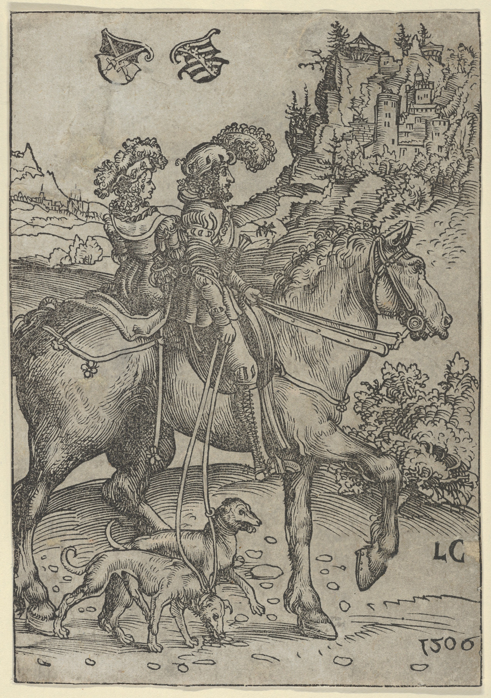
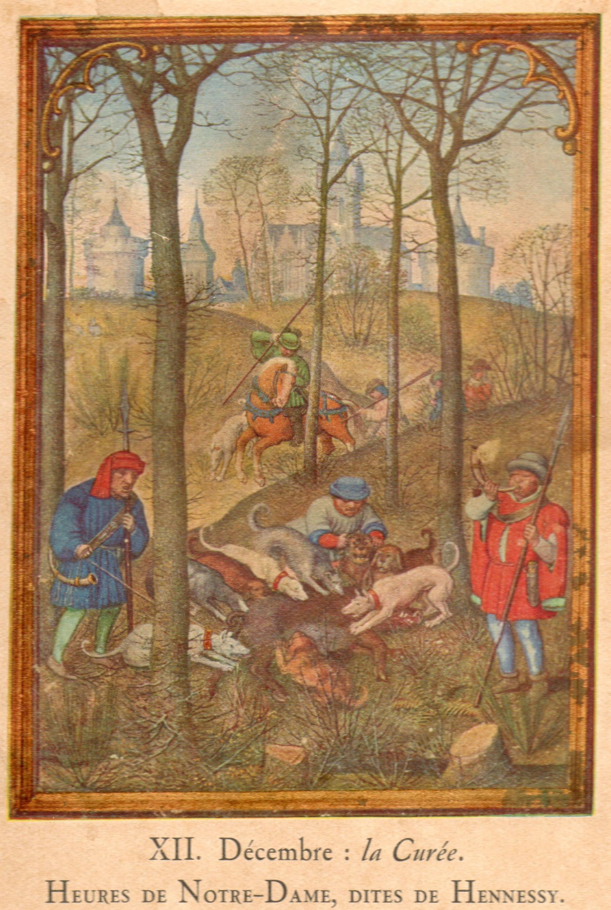
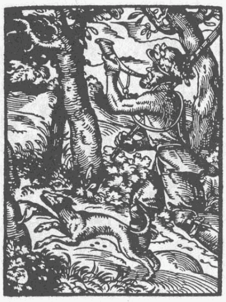

# Jäger

Ein Schuss aus dem Hinterhalt, eine Schlinge im Dunkel, ein Reh, das niemand gesehen haben will – Wilderei war im Mittelalter weder selten noch moralisch geächtet, wenn man die Bauern fragte. Für Adlige und König war Jagd dagegen ein heiliges Vorrecht, ein Zeichen von Macht und Rang. Zwischen diesen beiden Welten lebte der Jäger: als geduldeter Diener des Adels, als gefürchteter Waldwächter – oder als verfolgter Verbrecher, der nachts Netze aufstellte und am Morgen tat, als wäre nichts gewesen.

---

## Wer waren die Jäger?

Jagd war im mittelalterlichen und frühneuzeitlichen Deutschland kein freies Recht – sie war ein **Jagdrecht**, das streng geregelt und sozial abgestuft war.[^1] Man unterschied zwischen:

- **Hoher Jagd** (*Wildbann*): das Recht, auf Hirsch, Wildschwein, Bär, Wolf und Wildpferd zu jagen. Dieses Recht war ausschließlich dem Kaiser, den Fürsten und dem Hochadel vorbehalten.[^2]
- **Niederer Jagd**: Hasen, Füchse, Dachse, Wildvögel und anderes Kleinwild. Dieses Recht konnte an Niederadel, Klöster und städtische Obrigkeiten verliehen werden.

Die **Bauern** hatten grundsätzlich kein Jagdrecht – und das, obwohl das Wild täglich ihre Felder verwüstete. Diese Spannung war eine der tiefsten sozialen Wunden der vorindustriellen Gesellschaft.

Der **Berufsjäger** oder **Jagdgehilfe** arbeitete im Dienst des Adels. Er pflegte die Jagdhunde, legte Fallen, kannte die Wildwechsel, begleitete die Herrschaft auf der Jagd und sorgte dafür, dass die Wildbestände für die nächste Jagdsaison ausreichend groß blieben.[^3]

---

## Was haben sie gemacht?

### Die Jagd: ein hochorganisiertes Ritual

Adlige Jagden – besonders die große **Treibjagd** – waren aufwändige Ereignisse. Dutzende von Treibern, Hundeführern und Jägern bereiteten tagelang vor: Sie legten Schneisen frei, erkundeten Wildwechsel, stellten Netze und bauten Hochsitze.[^4]

Der Berufsjäger war dafür verantwortlich, das Wild in Schussweite zu treiben. Er kannte die Geländestruktur des Waldes genau und wusste, wann und wo welches Wild zu finden war. In den Wintermonaten fütterte er das Wild an bestimmten Stellen, um es im Revier zu halten – nicht aus Mitgefühl, sondern um es für die nächste Jagdsaison zu sichern und dem Herrn jederzeit vorzeigen zu können.[^5]

### Ausrüstung und Methoden

Je nach Jagdform nutzte der Jäger verschiedene Mittel:

- **Armbrust und später Schusswaffe**: für die eigentliche Jagd auf Abstand
- **Speer und Saufeder**: für den gefährlichen Nahkampf mit Wildschweinen
- **Fallen und Schlingen**: für Kleinwild – aber auch für größere Tiere, wenn illegal eingesetzt
- **Jagdnetze**: große Treibnetze, die Wild in bestimmte Abschnitte drängten
- **Jagdhunde**: speziell gezüchtete Rassen für unterschiedliche Aufgaben – Hetzhunde, Spurhunde, Vorstehhunde[^6]

---

## Jagdformen: vom stillen Anschleichen bis zur Hetzjagd zu Pferd

Jagd war nicht gleich Jagd. Je nach Tierart, sozialem Stand und Saison gab es grundlegend verschiedene Jagdformen, die unterschiedliches Personal, unterschiedliche Ausrüstung und unterschiedliche Vorbereitungszeit verlangten.

### Die Pirschjagd – der stille Einzelne

Die **Pirschjagd** (von mittelhochdeutsch *birsen*, anschleichen) war die älteste und technisch anspruchsvollste Form: Ein einzelner Jäger oder eine kleine Gruppe schlich sich im Schutz von Büschen und Geländekuppen an das Wild heran.[^18] Sie verlangte tiefes Wissen über Tierverhalten, Windrichtung und jedes Geräusch im Wald – und vor allem Geduld.

Für den Berufsjäger war die Pirsch Alltagsarbeit. Für den Adligen war sie eine Tugendprobe: Ein Fürst, der in der Pirsch versagte, stand schlechter da als einer, der beim höfischen Bankett trank.

### Die Treibjagd – das Spektakel der Herrschaft

Die **Treibjagd** war das Gegenteil der Pirsch: laut, aufwändig, sozial wirksam. Dutzende, manchmal Hunderte von Treibern drängten das Wild auf Schusslinien oder in Netzkorridore, wo der Adel wartete.[^19] Nicht die Jagdkunst des Einzelnen stand im Vordergrund, sondern die Machtdemonstration: Wer so viel Personal aufbieten konnte, der war reich und mächtig.

Für den Berufsjäger bedeutete die Treibjagd wochenlange Vorbereitung: Wildwechsel erkunden, Schneisen schlagen, Netze setzen, Hunde koordinieren. Den eigentlichen Schuss tat dann oft der Adlige – der Jäger hatte die ganze Arbeit gemacht, ohne den Ruhm zu ernten.

### Die Beizjagd (Falknerei) – die Kunst der Könige

Noch prestigeträchtiger als die Treibjagd galt die **Beizjagd**: die Jagd mit abgerichteten Greifvögeln – Falken, Habichten und Adlern.[^20] Ein gut abgerichteter Jagdfalke kostete im Mittelalter mehr als ein Pferd. Kaiser Friedrich II. verfasste im 13. Jahrhundert mit *De arte venandi cum avibus* (Über die Kunst, mit Vögeln zu jagen) das erste große wissenschaftliche Werk über Falknerei in Europa – ein Zeichen, wie hoch das Ansehen dieser Jagdform war.

Die Ausbildung eines Falken dauerte Jahre. Nur spezialisierte **Falkner** beherrschten die Kunst. Beizjagd war damit nicht nur eine Jagdform – sie war eine eigene Profession und ein Zeichen höchster Bildung. Wer einen Falken auf der Faust trug, zeigte: Ich gehöre zur obersten Schicht.

### Die Parforce-Jagd – Hetzjagd ohne Gnade

Bei der **Parforce-Jagd** (von französisch *par force*, durch Kraft) wurde ein einzelner Hirsch von einem Hunderudel und Reitern so lange gejagt, bis er vor Erschöpfung zusammenbrach.[^21] Diese Form war bei absolutistischen Herrschern des 17. und 18. Jahrhunderts beliebt – spektakulär und schnell.

Für den Wald war die Parforce-Jagd verheerend: Reiter und Hunde durchbrachen rücksichtslos Jungwuchs und Feldflächen. Für die Bauern, deren Äcker die Reiter querten, gab es keine Entschädigung.

---

## Das Jagdhorn: Signal, Sprache und Statussymbol

Kein Gegenstand war so eng mit dem Berufsbild des Jägers verbunden wie das **Jagdhorn**. Es war Kommunikationsmittel, Statussymbol und akustische Sprache in einem.[^22]

Das Horn – ursprünglich ein echtes Tierhorn, später ein metallenes Instrument – war das Hauptverständigungsmittel auf jeder größeren Jagd. Unterschiedliche **Hornrufe** (auch *Jägersprache* genannt) signalisierten präzise Situationen:

- **Aufbruch**: Der Jagdzug setzt sich in Bewegung
- **Horrido**: Wild ist gesichtet
- **Halali**: Das Wild ist gestellt oder erlegt
- **Totschrei**: Das Wild ist gefallen, die Jagd beendet
- **Tierart-Fanfare**: Je nach Wildart unterschiedliche Rufe – Hirsch, Sau und Fuchs hatten je eigene Töne[^23]

Nur ausgebildete Berufsjäger beherrschten das volle Repertoire. Wer falsch blies, machte sich vor der Herrschaft lächerlich. Das *Ständebuch* von Jost Amman (1568) – die wichtigste zeitgenössische Dokumentation der Berufsbilder Mitteleuropas – zeigt den Jäger mit dem Jagdhorn als zentralem Erkennungsmerkmal seines Standes.

---

## Das Wildproblem: wenn das Recht nach hinten schießt

Hier liegt einer der bittersten Widersprüche des feudalen Systems. Der Adel hatte das alleinige Recht zu jagen – und gleichzeitig konnte der Bauer nichts dagegen tun, wenn Hirsche seinen Roggen fraßen und Wildschweine seine Felder aufwühlten.[^7]

Der **Wildschaden** war real und existenzbedrohend. Ein einziger Hirschrudel konnte in einer Nacht die Jahresernte einer kleinen Bauernfamilie vernichten. Der Bauer durfte keine Waffe erheben. Er durfte das Wild nicht verscheuchen – zumindest nicht mit Methoden, die als Jagd galten. Er durfte nur zusehen, Verluste melden und hoffen, dass der Jäger des Herrn das Wild fernhielt.[^8]

Diese Spannung war politisch gefährlich. In den **Zwölf Artikeln der Bauernkriege** (1525) – dem wichtigsten Forderungskatalog des deutschen Bauernaufstands – steht als einer der ersten Punkte die Forderung, dass das Recht zu jagen, zu fischen und den Wald frei zu nutzen allen Menschen gehören solle, nicht nur dem Adel.[^9] Die Unterdrückung des Jagdrechts war demnach nicht nur eine Rechtsfrage – sie war ein Brennpunkt, an dem sich sozialer Unmut entzündete, der schließlich in einem der blutigsten Aufstände der deutschen Geschichte explodierte.

---

## Wilderei: das stille Recht der Armen

Offiziell war Wilderei verboten und wurde hart bestraft: **Handverlust**, **Blendung**, in manchen Territorien sogar die **Todesstrafe** für wiederholtes Wildern.[^10] Praktisch war Wilderei weit verbreitet – und die Dorfgemeinschaften schwiegen. Wer nachts eine Schlinge aufstellte und morgens ein Reh herauszog, war für seine Nachbarn oft kein Verbrecher, sondern jemand, der seine Familie ernährte.

**Wildschützen** – organisierte oder zumindest wiederholend tätige Wilderer – wurden in manchen Regionen zu Volkshelden. Sie galten als diejenigen, die dem Adel das nahmen, was er den Armen vorenthielt.[^11] Tatsächlich war die Motivation meist schlicht: Hunger. Nicht Revolution.

Der Jäger im Dienst des Adels stand diesen Männern gegenüber. Er sollte Wilderer aufspüren, festnehmen und anzeigen. Oft kannte er sie persönlich – Nachbarn, Verwandte, Menschen aus demselben Dorf. Das machte seinen Beruf zu einem echten moralischen Dilemma.[^12]

---

## Im Jenaer Wald

Die Herzöge von Sachsen-Weimar unterhielten im thüringischen Raum ausgedehnte **Jagdreviere**.[^13] Der Jenaer Wald war Teil dieser Reviere. Berufsjäger im Dienst des Hofes streiften durch die Wälder rund um Jena, kontrollierten Wildbestände, legten Futterplätze an und organisierten Jagden für den Herzog und seine Gäste.

Gleichzeitig: Die Bauern aus den umliegenden Dörfern hatten massive Probleme mit Wildschäden. Archivalische Quellen zeigen, dass Beschwerden über Hirsch- und Wildschweinfraß im Jenaer Umland im 17. und 18. Jahrhundert häufig und dringlich waren.[^14] Der Jäger war aus Sicht der Bauern nicht ihr Beschützer. Er war der Mann, der verhinderte, dass sie sich selbst helfen konnten.

---

## Zwischen Dienst und Dilemma: der Jäger als Grenzfigur

Kein anderer Waldberuf bewegte sich so zwischen den gesellschaftlichen Schichten wie der des Jägers. Er arbeitete für die Herrschaft, kannte aber den Wald und seine Menschen besser als jeder Adlige. Er durfte jagen – und sah täglich, wie das Jagdrecht anderen schadete.

Manche Jäger nutzten ihre Position aus: Sie kassierten Bestechungsgelder von Bauern, die gelegentlich eine Schlinge aufstellten, und schauten weg. Andere verfolgten Wilderer konsequent – und machten sich damit bei der Dorfgemeinschaft verhasst.[^15] Der Jäger war keine einfache Figur: kein eindeutiger Held, kein eindeutiger Schurke. Er war ein Mensch in einem System, das strukturell ungerecht war – und der täglich entscheiden musste, wie viel davon er mittragen wollte.

---

## Das Ende einer Ära

Im Zuge der **Deutschen Revolution von 1848** und der darauf folgenden Reformen wurde das feudale Jagdrecht in den meisten deutschen Staaten abgeschafft. Das Jagdrecht wurde nun an den **Grundbesitz** geknüpft, nicht mehr an den Stand.[^16] Wer Land besaß, durfte darauf jagen oder das Recht verpachten.

Das war ein gewaltiger Wandel – aber keine vollständige Demokratisierung. Arme Kleinbauern hatten auf ihren winzigen Parzellen weiterhin kein eigenständiges Jagdrecht, denn dafür war das Grundstück zu klein. Und der Adel pachtete weiterhin große Reviere. Was sich aber grundlegend änderte: Wilderei war nun nicht mehr symbolisch der Widerstand gegen ein feudales Unrecht. Sie war schlicht Diebstahl.

---

## Spuren bis heute

Das Jagdrecht ist bis heute ein eigenes Rechtsgebiet in Deutschland. Das **Bundesjagdgesetz** von 1952 und die Landesjagdgesetze regeln, wer wo jagen darf und wie der Wildbestand zu pflegen ist.[^17] Hunderte mittelalterlicher Jagdtürme, -schlösser und -hütten in Deutschland zeugen von der Bedeutung der höfischen Jagd. Ortsnamen wie **Jagdschloss**, **Wildpark**, **Jägerhaus**, **Wildbad** oder **Hohe Jagd** erinnern an eine Zeit, als das Recht zu jagen der sichtbarste soziale Grenzstein zwischen Adel und Volk war – und der Jäger darüber wachte.

---

## Konflikte und Fragen für den Chat

* Ein Bauer sieht nachts, wie sein Nachbar – ein Wilderer – ein Reh aus dem Wald zieht. Seine eigene Familie hat Hunger. **Soll er den Wilderer anzeigen oder schweigen?**
* Ein Jäger im Dienst des Herzogs findet Schlingen in seinem Revier. Er kennt den Urheber: ein alter Mann aus dem Nachbardorf, der keine andere Möglichkeit mehr hat, seine Familie zu ernähren. **Was tut der Jäger – und warum?**
* Der Herzog will ein neues Wildgehege anlegen – mitten durch das beste Ackerland dreier Dörfer. Die Bauern sollen weichen. **Wie reagieren die Bauern, und was kann der Pfarrer oder Schultheiß tun?**

---

## Weiterführende Links zur Recherche

* [Jagdrecht – Wikipedia](https://de.wikipedia.org/wiki/Jagdrecht): Geschichte des deutschen Jagdrechts vom Mittelalter bis heute
* [Wilderei – Wikipedia](https://de.wikipedia.org/wiki/Wilderei): Was war Wilderei, wie wurde sie bestraft – und welche soziale Bedeutung hatte sie?
* [Zwölf Artikel – Wikipedia](https://de.wikipedia.org/wiki/Zw%C3%B6lf_Artikel): Die Forderungen des deutschen Bauernaufstands von 1525 – Jagd und Wald als Streitpunkte
* [Hohe Jagd – Wikipedia](https://de.wikipedia.org/wiki/Hohe_Jagd): Was ist die hohe Jagd, und wer durfte sie ausüben?
* [Jagdhund – Wikipedia](https://de.wikipedia.org/wiki/Jagdhund): Rassen und historische Aufgaben der Jagdhunde
* [Jagdhorn – Wikipedia](https://de.wikipedia.org/wiki/Jagdhorn): Geschichte und Bedeutung des Jagdhorns – von der akustischen Signalgebung zum Statussymbol
* [Falknerei – Wikipedia](https://de.wikipedia.org/wiki/Falknerei): Beizjagd als immaterielles Weltkulturerbe der UNESCO
* [Pirschjagd – Wikipedia](https://de.wikipedia.org/wiki/Pirsch): Die älteste und technisch schwierigste Jagdform
* [Parforce-Jagd – Wikipedia](https://de.wikipedia.org/wiki/Parforcejagd): Hetzjagd zu Pferd und ihre Geschichte in Deutschland
* [Thüringer Landesmuseum Heidecksburg Rudolstadt](https://www.heidecksburg.de/): Thüringische Hof- und Jagdgeschichte mit historischen Sammlungen zur herzoglichen Jagd

---

## Literatur

[^1]: Rösener, Werner: Die Geschichte der Jagd. Kultur, Gesellschaft und Jagdwesen im Wandel der Zeit. Düsseldorf 2004, S. 112–115 (Struktur des mittelalterlichen Jagdrechts; hohe und niedere Jagd; ständische Bindung des Jagdprivilegs).

[^2]: Ebd., S. 115–118 (Wildbann als königliches und fürstliches Reservatrecht; Abgrenzung zur niederen Jagd; Entwicklung im Hochmittelalter).

[^3]: Leppin, Volker / Hartzsch, Gerhard: Historische Holzberufe. Hrsg. v. Landesbetrieb Forst Brandenburg. Potsdam 2014, S. 26–28 (Berufsjäger im Dienst des Adels; Aufgaben der Jagdgehilfen; Pflege von Wildbeständen und Jagdhunden).

[^4]: Rösener 2004, S. 141–145 (Treibjagd als aufwändiges höfisches Ereignis; Organisation und Ablauf; logistische Rolle der Berufsjäger).

[^5]: Küster, Hansjörg: Geschichte des Waldes. Von der Urzeit bis zur Gegenwart. München 1998, S. 197–199 (Wildfütterung und Hegepraxis; künstliche Erhaltung von Wildbeständen durch Berufsjäger im Dienst der Herrschaft).

[^6]: Rösener 2004, S. 148–153 (Jagdwerkzeug; Armbrust, Speer, Saufeder; Jagdnetze; Hundehaltung und Rassenentwicklung für verschiedene Jagdformen).

[^7]: Eckardt, Hans Wilhelm: Herrschaftliche Jagd, bäuerliche Not und bürgerliche Kritik. Zur Geschichte der fürstlichen und adligen Jagdprivilegien vornehmlich im südwestdeutschen Raum. Göttingen 1976, S. 45–52 (Wildschaden als systematisches und existenzbedrohendes Problem; Rechtlosigkeit der Bauern gegenüber Wildschäden).

[^8]: Ebd., S. 53–58 (konkrete Beschränkungen der Bauern: Verbot des Jagdrechts, Verbot aktiver Wildabwehr; Wege der Beschwerde).

[^9]: Schreg, Rainer: Kahlschlag? Im Urwald? In: Hirbodian, Sigrid / Scheible, Johanna (Hg.): Wald im Mittelalter. Tübingen 2024, S. 36–62, hier S. 47–48 (Zwölf Artikel 1525; Jagd- und Fischereifreiheit als Bauernforderung; Wald als zentraler sozialer Konfliktraum im Bauernkrieg).

[^10]: Rösener 2004, S. 195–197 (Strafrecht für Wilderei: Handverlust, Blendung, Todesstrafe; regionale Unterschiede in der Strenge; Verschärfung der Strafen im 17. und 18. Jahrhundert).

[^11]: Eckardt 1976, S. 88–93 (Wildschützen als Volkshelden; Grenze zwischen sozialem Widerstand und Kriminalität; Dorfsolidarität gegenüber obrigkeitlicher Verfolgung).

[^12]: Mantel, Kurt: Wald und Forst in der Geschichte. Ein Lehr- und Handbuch. Alfeld/Hannover 1990, S. 176–178 (sozialer Druck auf Jäger; Konflikt zwischen Dienstpflicht gegenüber dem Herrn und Loyalität zur Dorfgemeinschaft).

[^13]: Regnath, R. Johanna: Energie – Werkstoffe – Nahrung. Wald als zentrale Rohstoffquelle der Frühen Neuzeit. In: Hirbodian / Scheible 2024, S. 77–96, hier S. 82–83 (thüringische Jagdreviere der Herzöge von Sachsen-Weimar; Jenaer Waldgebiet als Teil höfischer Jagdorganisation).

[^14]: Eckardt 1976, S. 60–63 (archivalische Belege für Wildschadenbeschwerden im 17. und 18. Jahrhundert; regionale Fallstudien aus Thüringen und Sachsen).

[^15]: Rösener 2004, S. 200–202 (Korruption und Grauzone im Jägerberuf; Bestechung durch Wilderer; unterschiedliches Verhalten der Jäger gegenüber Wilddiebstahl in der Praxis).

[^16]: Ebd., S. 248–252 (Revolution von 1848; Abschaffung des feudalen Jagdrechts in deutschen Staaten; Bindung des Jagdrechts an Grundbesitz; Fortbestehen sozialer Ungleichheit im Pachtrecht).

[^17]: Hasel, Karl / Schwartz, Ekkehard: Forstgeschichte. Ein Grundriss für Studium und Praxis. 3. Aufl. Remagen 2002, S. 312–315 (Bundesjagdgesetz 1952; Regelung von Jagdrecht, Hegeverpflichtung und Wildschadensersatz im modernen Deutschland).

[^18]: Rösener 2004, S. 130–135 (Pirschjagd: Technik, Ausrüstung und soziale Bedeutung; Anforderungen an Geduld und Ortskenntnis; Pirsch als Tugendprüfung für den Adel).

[^19]: Ebd., S. 141–148 (Treibjagd: Organisation und Personalaufwand; Rolle der Berufsjäger bei der Vorbereitung; Machtdemonstration als sozialer Zweck).

[^20]: Ebd., S. 155–165 (Beizjagd/Falknerei: Kosten und Ausbildungsdauer von Falken; Friedrich II. und *De arte venandi cum avibus*; Falkner als Berufsstand; soziale Exklusivität der Beizjagd).

[^21]: Ebd., S. 175–179 (Parforce-Jagd: Ablauf der Hetzjagd; Popularität im Absolutismus; Waldzerstörung und Konflikte mit der Landbevölkerung).

[^22]: Ebd., S. 136–140 (Jagdhorn: Entwicklung vom Tierhorn zum Metallinstrument; Funktion als Kommunikationsmittel und Statussymbol; Hornrufe als Jägersprache).

[^23]: Eckardt 1976, S. 30–32 (Hornrufe und ihre Bedeutungen: Aufbruch, Horrido, Halali, Totschrei; tierartspezifische Fanfaren; Bedeutung des richtigen Blasens für das Ansehen des Jägers).
