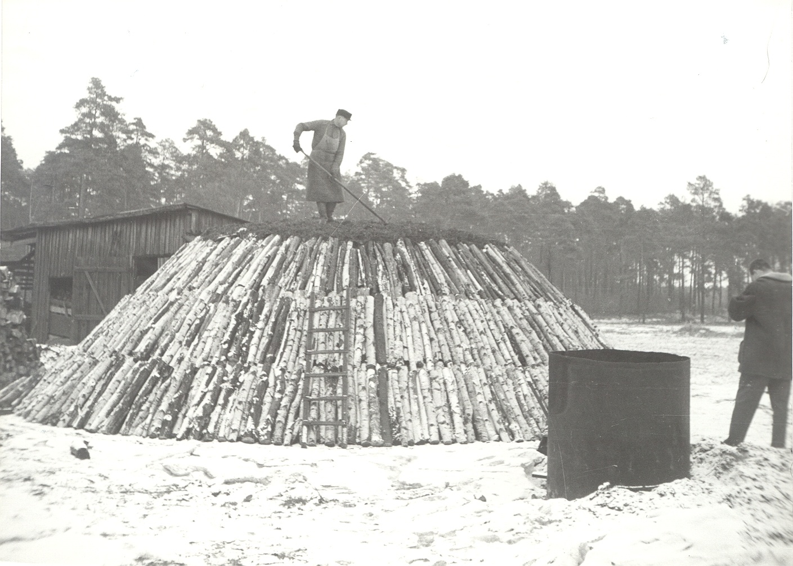
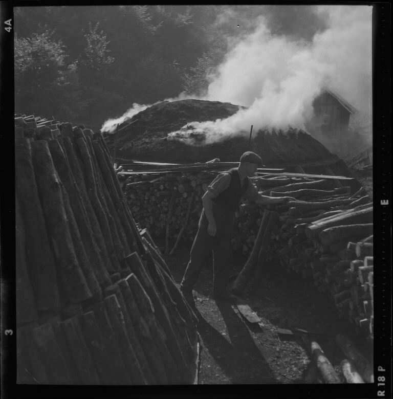

# Köhler

Monatelang lebten die Köhler allein im Wald. Sie bewachten ihren glühenden Meiler Tag und Nacht – denn wenn der Haufen falsch brannte, war wochenlange Arbeit umsonst. Dunkle Rauchwolken und beißender Geruch wiesen den Weg zu ihren Lagern, weithin sichtbar und weithin gemieden. Köhler waren die unsichtbaren Helden hinter Glas, Metall und Werkzeug – und gleichzeitig die am stärksten gefürchteten Waldnutzer ihrer Zeit.

!

---

## Wer waren die Köhler?

Köhler waren Handwerker, die **Holzkohle** durch gesteuertes Schwelen von Holz herstellten. Ihr Beruf war körperlich erschöpfend, sozial isoliert und gesellschaftlich wenig angesehen – dabei war ihre Arbeit für alle anderen Berufsgruppen unverzichtbar: ohne Holzkohle kein geschmolzenes Eisen, kein gesottenes Salz, kein geblasenes Glas.

Es gab zwei Hauptformen des Betriebs. Die ältere war die  **Wanderköhlerei** : Köhler zogen von Wald zu Wald, je nachdem wo frisches Holz verfügbar war – denn Holzkohle ist leicht transportierbar, das Holz selbst aber schwer.[^1] Ab dem 13. Jahrhundert entstanden zunehmend  **ortsfeste Köhlereien** , die unter stärker herrschaftlicher Kontrolle standen und an bestimmte Waldgebiete gebunden waren.[^2]

---

## Was haben sie gemacht?

### Der Meiler

Der Köhler baute einen  **Meiler** : einen großen, kuppelförmigen Haufen aus sorgfältig gestapeltem Holz, der mit Erde und feuchtem Laub abgedeckt wurde. Als Ausgangsmaterial dienten vor allem die **Stubben** – die Wurzelstöcke der Bäume, die Holzhauer zuvor gefällt hatten.[^3] Das verwertete, was andere übrig ließen.

Dann wurde der Meiler von innen entzündet und musste nun tagelang, manchmal wochenlang, langsam und gleichmäßig  **schwelen** . Zu heiß, und das Holz verbrennt zu Asche. Zu kalt, und es entsteht keine Holzkohle. Der Köhler wachte rund um die Uhr, kontrollierte Temperatur und Rauchabzug, schüttete immer wieder Erde nach. Schlaf in kurzen Phasen, immer in Hör- und Sichtweite des Meilers.

### Teeröfen: die Industrialisierung der Köhlerei

Ab Mitte des 16. Jahrhunderts kamen neben den Meilern **massive Teeröfen** hinzu – doppelwandige Steinbauten, die neben Holzkohle auch **Holzteer** erzeugten, der für Schiffbau und Seilerei gebraucht wurde.[^4] Ein einziger Teerofen konnte pro Brennvorgang zwischen 15 und 100 Raummeter Holz verarbeiten. Bei den erlaubten **acht Bränden pro Jahr** ergibt das einen Jahresbedarf von etwa  **600 Raummetern Holz pro Teerofen** .[^5]

Das Verhältnis von Einsatz zu Ertrag: Aus einem Raummeter Klobenholz entstanden etwa **120 Kilogramm Holzkohle** und rund  **10 Liter Holzteer** .[^6] Letzterer wurde in einer Rinne aufgefangen. Holzkohle selbst war das mengenmäßig größte Endprodukt – Teer war wertvoll, aber die Kohle war das, worauf alle warteten.

---

## Der Köhler und der Wald: Ein ungleiches Verhältnis

Köhlereien und Teeröfen gehörten zu den **größten Holzverbrauchern** überhaupt – noch vor Glashütten und Salinen.[^7] Für die Eisenverhüttung wurden pro Tonne Roheisen etwa fünf Tonnen Holzkohle benötigt; hochmittelalterliche Erzanlagen betrieben teils über 1.000 Meiler gleichzeitig.[^8] Das bedeutete: Köhler mussten immer weiter in den Wald vordringen, immer neue Bestände erschließen.

Gleichzeitig durften Köhler nur dort arbeiten, **wo keine anderen holzverarbeitenden Großbetriebe** tätig waren – so regelten es die Waldordnungen.[^9] Das zeigt: Der Konflikt um Holz war nicht nur zwischen Köhlern und Förster, sondern zwischen allen Holzverbrauchern gleichzeitig. Wer das begrenzte Holzangebot eines Waldgebietes bekam, war eine Machtfrage.

---

## Im Jenaer Wald

Die Glasmacher rund um Jena benötigten enorme Mengen Holzkohle für ihre Schmelzöfen. Eine Glashütte allein verbrauchte rund  **3.000 Raummeter Brennholz pro Jahr** .[^10] Das bedeutete für die Köhler: dauerhafter Betrieb, dauerhafter Waldverbrauch, dauerhafter Druck. Archäologische Holzkohleanalysen aus dem thüringischen und schwäbischen Raum belegen, dass Köhlerei als wichtige Waldnutzung seit dem Mittelalter kontinuierlich betrieben wurde – und dabei massiv in die Baumartenzusammensetzung eingriff.[^11]

---

## Ausgegrenzt und gefürchtet: die soziale Stellung der Köhler

Köhler wurden von der Dorfbevölkerung  **ausgegrenzt und gemieden** . Drei Gründe spielten zusammen: ihr leichtsinniger Umgang mit Feuer (ein entflammter Meiler konnte den ganzen Wald gefährden), ihr äußeres Erscheinungsbild (rußgeschwärzt, stets nach Rauch riechend) und der Verdacht, sie würden nebenbei  **wildern** .[^12]

Die Feindschaft war nicht nur sozial – sie wurde gewalttätig. Im Jahr 1724 musste **König Friedrich Wilhelm I.** mit einem Erlass einschreiten, als Dorfbewohner begannen, Teeröfen mit  **Sprengstoff zu beschädigen** . Die angedrohte Strafe betrug zehn Reichstaler.[^13] Dass der König persönlich eingreifen musste, zeigt, wie tief die Feindschaft saß – und wie wirtschaftlich unentbehrlich die Köhler trotzdem waren.

---

## Das Ende einer Ära

Mit dem zunehmenden Einsatz von **Steinkohle** im 19. Jahrhundert verlor die Holzkohle immer mehr an Bedeutung. Um 1850 gehörten noch arbeitende Teeröfen zu den Ausnahmen. In der Region des Menzer Forstes (Brandenburg) endete 1948 mit der Einstellung des Betriebs in **Menz-Neuroofen** eine fast drei Jahrhunderte alte Ära.[^14] In Deutschland und Europa ist die gewerbliche Köhlerei heute nahezu vollständig verschwunden – mit Ausnahme einiger weniger Regionen in Rumänien.

---

## Spuren bis heute

Wer im Jenaer Wald genau hinschaut, findet noch heute **dunkle, kreisrunde Stellen im Boden** – das sind alte Kohlplätze, wo die Meiler standen. Die schwarze Erde kommt von Holzkohleresten, die sich über Jahrhunderte im Boden erhalten haben. Ortsnamen wie  **Kohlberg** , **Kohlenstraße** oder **Theerofen** erinnern ebenfalls an diesen Beruf.[^15] Und Familiennamen wie Köhler, Kohler oder Kohlmeyer tragen die Erinnerung bis heute in sich.

---

## Konflikte und Fragen für den Chat

* Ein Köhler braucht für einen Winter drei Waldabschnitte voller Bäume. Der Förster sagt, das sei zu viel – der Wald wächst nicht schnell genug nach. **Wer hat Recht?**
* Die Dorfbewohner beschweren sich beim Landesherren: Der Köhler hat wieder Nacht für Nacht Feuer im Wald. Es riecht nach Rauch, und sie haben Angst. **Was soll der Landesherr tun?**
* Der Glasmacher braucht dringend Holzkohle für seine Schmelzöfen. Der Köhler will mehr bezahlt werden. Der Förster will den Einschlag begrenzen. **Wie endet dieser Streit?**

---

## Weiterführende Links zur Recherche

* [Köhlerei – Wikipedia](https://de.wikipedia.org/wiki/K%C3%B6hlerei): Alles über den Beruf des Köhlers, den Meiler und die Technik der Holzkohlegewinnung
* [Holzkohle – Wikipedia](https://de.wikipedia.org/wiki/Holzkohle): Wie Holzkohle entsteht und wofür sie gebraucht wurde
* [Meiler – Wikipedia](https://de.wikipedia.org/wiki/Meiler): Der Aufbau und Betrieb eines Kohlemeilers
* [Teerofen – Wikipedia](https://de.wikipedia.org/wiki/Teerofen): Die industrialisierte Variante der Köhlerei ab dem 16. Jahrhundert
* [Freilichtmuseum Glentleiten](https://www.glentleiten.de/): Historische Handwerke in Bayern – mit Demonstrationen historischer Waldberufe
* [Köhlereimuseum Lerbach (Harz)](https://www.bergbaumuseum.de/): Dokumentation der Köhlerei im Harz

---

## Literatur

[^1]: Schreg, Rainer: Kahlschlag? Im Urwald? In: Hirbodian, Sigrid / Scheible, Johanna (Hg.): Wald im Mittelalter. Tübingen 2024, S. 36–39 (Wanderköhlerei bis Spätmittelalter; Holzkohle leicht transportierbar).
    
[^2]: Ebd., S. 39 (ortsfeste Köhlereien ab 13. Jh. mit herrschaftlichen Regulierungen).
    
[^3]: Leppin, Volker / Hartzsch, Gerhard: Historische Holzberufe. Hrsg. v. Landesbetrieb Forst Brandenburg. Potsdam 2014, S. 67 (Stubben als Ausgangsmaterial).
    
[^4]: Ebd., S. 66–67 (Teeröfen ab Mitte 16. Jh.).
    
[^5]: Ebd., S. 67 (8 Brände/Jahr; 15–100 Raummeter pro Brand; ca. 600 Raummeter Jahresbedarf).
    
[^6]: Ebd., S. 67 (aus 1 Raummeter Klobenholz: ca. 120 kg Holzkohle + ca. 10 Liter Holzteer).
    
[^7]: Ebd., S. 66 (Köhlereien und Teeröfen als größte Holzverbraucher).
    
[^8]: Schreg 2024, S. 35 (Eisenverhüttung: 5 t Holzkohle pro 1 t Eisen; hochmittelalterliche Erzanlagen teils über 1.000 Meiler).
    
[^9]: Ebd., S. 39 (Köhler durften nur dort arbeiten, wo keine anderen holzverarbeitenden Großbetriebe lagen).
    
[^10]: Leppin / Hartzsch 2014, S. 40–41 (Glashütten: ca. 3.000 Raummeter Brennholz/Jahr).
    
[^11]: Schreg 2024, S. 39–62 (Holzkohleanalyse: Rekonstruktion historischer Waldgeschichte durch Köhlerei-Standorte).
    
[^12]: Leppin / Hartzsch 2014, S. 68 (soziale Ausgrenzung wegen Feuergefahr, Erscheinungsbild, Wilddiebverdacht).
    
[^13]: Ebd., S. 68 (königlicher Erlass Friedrich Wilhelms I. 1724; Strafe 10 Reichstaler bei Beschädigung von Teeröfen).
    
[^14]: Ebd., S. 68 (letzter Betrieb Menz-Neuroofen eingestellt 1948).
    
[^15]: Ebd., S. 20 (Ortsnamen als historische Quellen: Theerofen, Kienofen u. a.).
